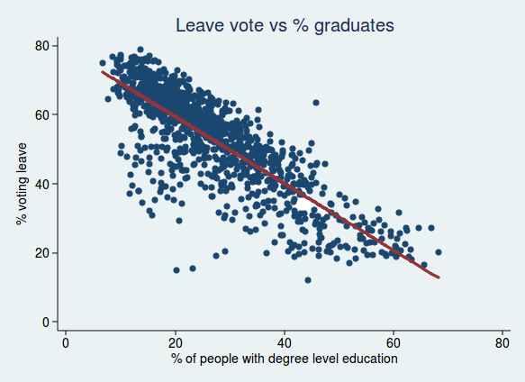
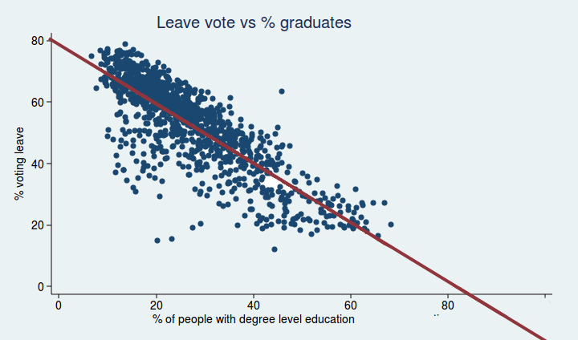
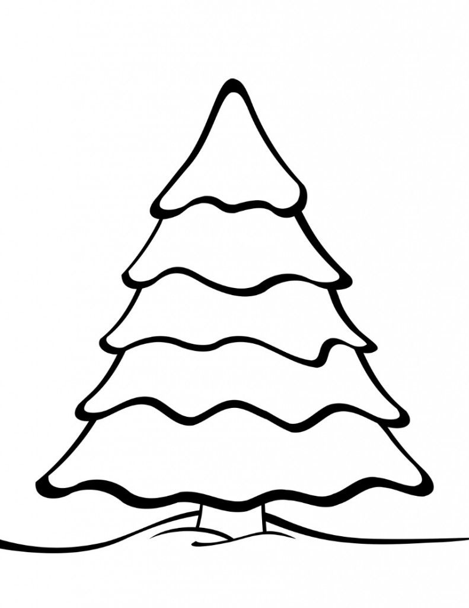

```{r, echo=FALSE, error=FALSE, warning=FALSE, results='asis'}
library(knitr)
library(png)
library(grid)
library(ggplot2)
library(data.table)

outputFormat = opts_knit$get("rmarkdown.pandoc.to")
color="red"
if(outputFormat %in% c('latex','beamer')) {
  note = function(x){cat(paste0("\\textcolor{",color,"}{{\\scriptsize ",gsub("[\r\n]", "\\\\\\\\", x),"}}\n\n"))} #2^n backslashes as n->infinity
} else if(outputFormat %in% c('html','ioslides')) {
  note = function(x){cat(paste0("<font color='",color,"',size='small'>",x,"</font>\n\n"))}
} else {
  cat(outputFormat)
  note = function(x){cat(x)}
}
final=F


#note = function(x){cat("")}; final=T #comment out for presenter notes
```

## 

$$\huge{P(\theta|x)=\frac{P(x|\theta)P(\theta)}{\int_{\theta'\in\Theta} P(x|\theta')P(\theta')d\theta'}}$$


```{r, out.width = "60px", echo=FALSE, results='asis'}
note("Always good to start a stats talk with Bayes' Thm. 
You've all seen this before.
     As you know, the trickiest part is the denominator. 
If integral is over hi-D space, naive numerical methods for estimating will have unacceptably high variance. 
So you need tricks.")
```

## Structure of thesis

* Chapter 1: online data assimilation in spatiotemporal systems
* Chapter 2: new method for variational inference on latent variable models
    * Contributions: Laplace guide families; analytic amortization
* Chapter 3: application to ecological inference (EI)
    * Contributions: Extensible model for EI; full algorithm and implementation of Laplace VI for this model


```{r, out.width = "60px", echo=FALSE, results='asis'}
note("SAY VI XXXXXXXXXXXXXX
Ch. 2: The VI framework is to assume the posterior is well-approximated... construct a new guide family that's able to...
Ch 3: More than a simple application. The model is more realistic and more extensible than the most common method, and applying VI here requires several tricks.
You will notice a few changes to what I sent you, particularly in the chapter 3 results; I will point them out as we go along")
```

## Collaborator on Ch. 2-3: Mira Bernstein

* On most things, equal collaborator and coauthor
* All the major motivating ideas, and >95% of the coding, is mine
* We checked that this is OK

## Variational Inference

Approximate w/ guide distribution $q_{\bm{\phi}}(\bm{\theta})$; choose $\bm{\phi}$ to mimize KL: 
$$\hat{{\bm{\phi}}}=\mathrm{argmin}_{\bm{\phi}}\left[D_{\mathrm{KL}} \left(\;q_{\bm{\phi}}(\bm{\theta})\;\big|\big|\; p(\bm{\theta}|\bm{x})\;\right)\right].$$
Equivalent to maximizing ELBO:
$$\mathrm{ELBO}({\bm{\phi}}):=E_{q_{\bm{\phi}}}
\left[\mathrm{log} p(\bm{x},\bm{\theta})-\mathrm{log} q_{\bm{\phi}}(\bm{\theta})\right]$$

```{r fig.width=4, fig.height=1.5,echo=FALSE}

options(tinytex.verbose = TRUE)


combined = data.table()
varidat = data.table(x=(-300:300)/100)
varidat[,`Density:`:=1]
varidat[,y:=3-log(1+x^2/5)*3+log(.2+exp(-16*(x-1.5)^2))]

combined = rbind(combined,varidat,fill=T)

varidat[,`Density:`:=2]
varidat[,y:=log(.9)-.9*x^2]
combined = rbind(combined,varidat,fill=T)

varidat[,`Density:`:=4]
varidat[,y:=log(.6)-.6*(x-.2)^2]
combined = rbind(combined,varidat,fill=T)

varidat[,`Density:`:=3]
varidat[,y:=log(16)-14*(x-1.46)^2]
combined = rbind(combined,varidat,fill=T)

combined[,`Density:`:=factor(`Density:`,levels=1:4,labels=c("Log posterior (unnormalized)","Laplace @ mode 1","Laplace @ mode 2","Best Gaussian (by ELBO)"))]

filtered = combined[y> -7, ]

ggplot(data=filtered, aes(x=x,y=y,color=`Density:`)) + geom_line(size=.3) + theme_void()


note("Re center, breathe. minimizing KL-divergence, ELBO ('this quantity')
Note model parameters here and guide parameters there
point to terms in ELBO b4 picture 
hill-climing means AD for gradient of the ELBO, so...")
```


## Computational tool: Pyro

Released in 2017 and still under very active development, pyro is a cutting-edge python package for black-box VI.

* Stochastic optimization (hill-climbing)
* Automatic differentiation via PyTorch ML

```{r, out.width = "60px", echo=FALSE, results='asis'}
note("Explain automatic differentiation
All the significant software engineering I had to do")
```


## Choosing a guide family

This talk will focus on Gaussian guide families.

The first obvious possibility for the guide family of a $d$-parameter model is just the unrestricted set of Gaussians.

* Mean: $d$ guide parameters (1 per model parameter)
* Covariances: $\mathcal{O}(d^2)$ guide parameters


```{r, fig.align='center', out.width = "150px", echo=FALSE, results='asis'}
note("can’t capture posterior correlations
systematically underestimates posterior marginals")
knitr::include_graphics("meanfield_covar_figure.jpg")
```

## Meanfield guide family

A common assumption is posterior independence of parameters, referred to as "meanfield" guides. Thus guide parameters:

* Mean: $d$ guide parameters (1 per model parameter)
* Variances: $d$ guide parameters (1 per model parameter; diagonal covariance matrix)

Problem:

```{r, fig.align='center', out.width = "150px", echo=FALSE, results='asis'}
note("can’t capture posterior correlations
systematically underestimates posterior marginals")
knitr::include_graphics("meanfield_covar_figure.jpg")
```

## Who will guide us?

Among Gaussian guide families:

* Set of all normals, with unrestricted covariance, is too big
* Meanfield subfamily doesn’t actually contain any good approximations
* We want subfamily that contains at least some good approximations without being too big

## Introducing: Laplace family

Let's guarantee that the family contains the Laplace approximation around any posterior mode. This allows us to parametrize only the mean, and then derive the precision matrix by the taking the observed information of the posterior: 

$\mathcal{I}_p\left(\bm{\theta}^*\right)  := -H\left[\log p(\bm{\theta})\right]\bigg\rvert_{\bm{\theta}^*}$

Thus, the guide parameters for a model $p(\theta)$ would be $\theta^*$, defining the point at which to take a Laplace approximation.

* Means ($\theta^*$): $d$ guide parameters (1 per model parameter)
* Covariance: 0 guide parameters! Just compute $\mathcal{I}_p(\theta^*)$.

```{r, fig.align='center', out.width = "150px", echo=FALSE, results='asis'}
note("Don't ignore correlation. Don't optimize over it. Just get it by calculus.")
```

## Boosting function

$\mathcal{I}_p$ not guaranteed to be positive definite. So define "boosting" function $f(\mathcal{I}_p)$ s.t.:

* Guaranteed p.d.
* Smooth almost everywhere.
* $f(\mathcal{I}_p)\approx\mathcal{I}_p$ if $\mathcal{I}_p$ already p.d.

A similar problem arises in optimization (quasi-Newton methods); solved via modified Cholesky algorithms (Surveyed in Fang, 2008; we use GMW81 by Gill, Murray, & Wright)

## Boosting family

xxxxx

Furthermore, we can parametrize $f$ to create a boosting family $f_{\bm{\psi}}$, for $\psi_i\in\mathbb{R}^D_+$, s.t. as $\bm{\psi}\rightarrow\vec{\bm{0}}$, $f(\mathcal{I}_p)\rightarrow\mathcal{I}_p$ if $\mathcal{I}_p$ already p.d.

```{r, out.width = "60px", echo=FALSE, results='asis'}
note("Boosting family is better than just boosting function.
D-dimensional so we can boost dif params dif.
Version of thesis sent previously has quasi-boosting which we’re no longer using")
```


## Formal definition of Laplace family

Let $p(\bm{\theta})$ be a (twice-differentiable) probability density over $\mathbb{R}^d$. 

Let $\Theta \subseteq \mathbb{R}^d$, $\Psi \subseteq \mathbb{R}^d_+$, and let $f_\Psi$ be a boosting family. 

Laplace guide: $q_{\bm{\theta}^*\in\Theta,\bm{\psi}\in\Psi}(\bm{\theta})$, a $d$-dimensional Gaussian with mean $\bm{\theta}^*$ and precision precision matrix $f_{\bm{\psi}} \left(\mathcal{I}_p(\bm{\theta}^*)\right)$.

Laplace guide family $\mathcal{L}_{\Theta\times\Psi} (p,f_\Psi)$: $\{q_{\bm{\theta}^*,\bm{\psi}}:\bm{\theta}^*\in\Theta,\;\bm{\psi}\in\Psi\}$

Thus, $2d$ guide parameters.

```{r, out.width = "60px", echo=FALSE, results='asis'}
note("Note that capital greek letters can be subspaces
theta-star tells mean; psi tells how aggressively to boost")
```


## Toy model

We want: $p(T_1,T_2|x=7)$
$$x= T_1+T_2+\epsilon$$
$$T_i\sim StudentT_{\nu}(0,1); i\in\{1,2\}$$
$$\epsilon\sim \mathcal{N}(0,\sigma^2)$$

```{r, fig.align='center', out.width = "150px", echo=FALSE, results='asis'}
knitr::include_graphics("beforemeanfield.pdf")
note("Simple model with bimodal posterior
Shows several things: Importance of covariance; case where laplace of MAP isn't optimal; case where boosting is necessary, and boosting family is better than boosting function
saddle point is ideal in this case, probably not always")
```

## Toy model

$$x= T_1+T_2+\epsilon$$
$$T_i\sim StudentT_{\nu}(0,1); i\in\{1,2\}$$
$$\epsilon\sim \mathcal{N}(0,\sigma^2)$$

```{r, fig.align='center', out.width = "150px", echo=FALSE, results='asis'}
knitr::include_graphics("beforelaplace.pdf")
note("Simple model with bimodal posterior
Shows several things: Importance of covariance; case where laplace of MAP isn't optimal; case where boosting is necessary, and boosting family is better than boosting function
saddle point is ideal in this case, probably not always")
```

## Toy model

$$x= T_1+T_2+\epsilon$$
$$T_i\sim StudentT_{\nu}(0,1); i\in\{1,2\}$$
$$\epsilon\sim \mathcal{N}(0,\sigma^2)$$

```{r, fig.align='center', out.width = "150px", echo=FALSE, results='asis'}
knitr::include_graphics("full.pdf")
note("Simple model with bimodal posterior
Shows several things: Importance of covariance; case where laplace of MAP isn't optimal; case where boosting is necessary, and boosting family is better than boosting function
saddle point is ideal in this case, probably not always")
```


## Latent variable models (or: why hi-D?)

A latent variable model has 3 core elements:

* Global parameters: $\bm{\gamma}\in\Gamma \cong \mathbb{R}^g$,
* Latent parameter vectors: $\bm{\lambda}_1,\dots,\bm{\lambda}_N\in\Lambda \cong \mathbb{R}^l$
* Observation vectors: $\bm{x}_1,\dots,\bm{x}_N$

$$p\left(\bm{\gamma}, \bm{\lambda}_1,\dots,\bm{\lambda}_N,\bm{x}_1,\dots,\bm{x}_N\right) = p(\bm{\gamma})\prod_{i=1}^N p(\bm{\lambda}_i|\bm{\gamma})\; p(\bm{x}_i|\bm{\lambda}_i,\bm{\gamma})$$

Laplace guide parameters: $\bm{\gamma}^*,\bm{\lambda}^*_1...\bm{\lambda}^*_N,\bm{\psi}$

```{r, out.width = "60px", echo=FALSE, results='asis'}
note("conditional independence
This is why we need a high-dimensional solution.")
```


## Latent variable models: Block Arrowhead Hessians

$$\mathcal{I}_p(\bm{\theta}^*) = \left(\begin{array}{cccccc}
    & \blue{\bm{\gamma}} & \blue{\bm{\lambda}_1} & \blue{\bm{\lambda}_2} & \blue{\dots} & \blue{\bm{\lambda}_N} \\
   \blue{\bm{\gamma}} & G & C_1 & C_2 & \dots & C_N \\
   \blue{\bm{\lambda}_1} & C_1^T & U_1 & 0 & \dots & 0 \\
   \blue{\bm{\lambda}_1} & C_2^T & 0 & U_2 & \dots & 0 \\
   \blue{\vdots} & \vdots & 0 & 0 & \ddots & 0 \\
   \blue{\bm{\lambda}_N} & C_N^T & 0 & 0 & \dots & U_N
   \end{array}\right)$$

* Easy to boost.
* Easy to sample from. Note that marginal covariance for $\bm{\gamma}$ is $[\mathcal{I}_p(\bm{\theta}^*)^{-1}]_{\Gamma,\Gamma}=(G-\sum_i C_iU_i^{-1}C_i^T)^{-1}$

```{r, out.width = "60px", echo=FALSE, results='asis'}
note("easy to sample from and easy to boost.")
```


## SVI (Stochastic Variational Inference)

```{r, out.width = "60px", echo=FALSE, results='asis'}
note("Two methods useful w/ LVM. Conceptually independent, but combine. 1st, standard:")
```

At each optimization step, let $\mathcal{S}$ be a random sample of units with $p(i\in \mathcal{S})=\pi_i$.

Replace
$$\mathrm{log}\;p(\bm{\theta},\bm{x}) := \mathrm{log}\;p(\bm{\gamma})+\sum_{i= 1}^N \Big[\mathrm{log}\;p(\bm{\lambda}_{i}|\bm{\gamma})\; +\mathrm{log}\;p(\bm{x}_{i}|\bm{\lambda}_{i},\bm{\gamma})\Big]$$
with the unbiased estimator
$$\mathrm{log}\;p_\mathcal{S}(\bm{\theta}_\mathcal{S},\bm{x}_\mathcal{S}) := \mathrm{log}\;p(\bm{\gamma})+\frac{1}{\pi_{i}}\sum_{i\in \mathcal{S}} \Big[\mathrm{log}\;p(\bm{\lambda}_{i}|\bm{\gamma})\; +\mathrm{log}\;p(\bm{x}_{i}|\bm{\lambda}_{i},\bm{\gamma})\Big]$$
Then compute Laplace guide for the latter expression, and find the ELBO gradient.

```{r, out.width = "60px", echo=FALSE, results='asis'}
note("If cheap way to predict bigger terms, weights; we haven't implementedl")
```


## SVI (Stochastic Variational Inference): unbiased?

With Laplace guide, this makes:

* Log density: unbiased
* Guide covariance of globals for given $\bm{\theta}^*$: Up to boosting, unbiased for both conditional precision and "marginal precision" (inverse of marginal covariance).
* ELBO and ELBO gradient: Not unbiased (unlike meanfield)

```{r, out.width = "60px", echo=FALSE, results='asis'}
note("ELBO \\& gradient not unbiased as in meanfield, but seem to work well")
```


## Amortization

Suppose we can find an analytic function for the (approximate) conditional MAP:  $f(\bm{\gamma},\bm{x}_i)\approx \mathrm{argmax}_{\bm{\lambda}_i}p(\bm{\lambda}_i|\bm{\gamma},\bm{x}_i)$

We can use it to restrict to a lower-dimensional subfamily of $\mathcal{L}$:

* Restrict $\Theta$: reduce the number of guide parameters by setting $\bm{\lambda}^*_i$ to $f(\bm{\gamma}^*,\bm{x}_i)$
* Also restrict $\Psi$: reuse the same boosting parameters for each unit

Laplace guide parameters: $\bm{\gamma}^*,\bm{\psi}_\gamma,\bm{\psi}_\lambda$

```{r, out.width = "60px", echo=FALSE, results='asis'}
note("Note that it's MAP not MLE. 
MAP is not perfect but it's close.
computationally cheap refinement is available")
```


## Multisite model

$$d := \log(\nu-\nu_{\min})\sim \mathcal{N}(1,1.5^2)$$
$$\varsigma := \log(\sigma-\sigma_{\min})\sim \mathcal{N}(0,2^2)$$
$$\mu\sim\mathcal{N}(0,20)\nonumber$$
$$\nu_{\min}=2.5,\;\sigma_{\min}=\max(s_i)*1.9$$


## Results

\includegraphics[width=3.65in]{ECHSfits.pdf}

```{r, out.width = "60px", echo=FALSE, results='asis'}
note("Changes: df; boosting (once for each diagonal block)")
```

## Ecological inference (EI)

EI: inferring individual behavior from aggregated data. 

Motivating example: voting behavior by racial or other groups

\resizebox{99in}{1.25in}{%
\begin{tikzpicture}[thick,scale=0.9, every node/.style={transform shape},
squared notebook/.pic={\clip[postaction={shade,left color=white}](0,0) rectangle (6.5,4);
\draw[ultra thick](0,0) rectangle (6.5,4);}
]
\foreach \x in {1.25,1,.75,0.5,.25,0}\pic at (\x,\x){squared notebook};
\draw[-latex] (7,0) -- +(1,1) node[below right,midway,rotate=45] {precinct};
\node[rotate=90] (h) at (.5,2) {Race};
\node (w) at (3.99,3.7) {Candidate};


\node (w) at (3.5,2) {$\begin{array}{r|ccc|l}
& X & Y & Z & n_u\\
\hline
White & \red{?} & \red{?} & \red{?} & 400 \\
Black & \red{?} & \red{?} & \red{?} & 200   \\
Hispanic & \red{?} & \red{?} & \red{?} & 100   \\
Other & \red{?} & \red{?} & \red{?} & 100   \\
\hline
v_u & 400 & 200 & 200 & 800\end{array}$};

%\node (w) at (4.5,-1) [text width=8.25cm]{Observed data for one hypothetical precinct};
\end{tikzpicture}}

```{r, out.width = "60px", echo=FALSE, results='asis'}
note("Mainly comes up in voting rights cases, so I’ll talk about it in this setting.
     Z could represent not voting.")
```

## Ecological inference (EI)

EI: inferring individual behavior from aggregated data. 

Motivating example: voting behavior by racial or other groups

\resizebox{99in}{1.25in}{%
\begin{tikzpicture}[thick,scale=0.9, every node/.style={transform shape},
squared notebook/.pic={\clip[postaction={shade,left color=white}](0,0) rectangle (6.5,4);
\draw[ultra thick](0,0) rectangle (6.5,4);}
]
\foreach \x in {1.25,1,.75,0.5,.25,0}\pic at (\x,\x){squared notebook};
\draw[-latex] (7,0) -- +(1,1) node[below right,midway,rotate=45] {precinct};
\node[rotate=90] (h) at (.5,2) {Race};
\node (w) at (3.99,3.7) {Candidate};


\node (w) at (3.5,2) {$\begin{array}{r|ccc|l}
& X & Y & Z & n_u\\
\hline
White & \red{400} & 0 & 0 & 400 \\
Black & 0 & \red{200} & 0 & 200   \\
Hispanic & 0 & 0 & \red{100} & 100   \\
Other & 0 & 0 & \red{100} & 100   \\
\hline
 v_u & 400 & 200 & 200 & 800\end{array}$};


%\node (w) at (4.5,-1) [text width=8.25cm]{Possible underlying data A: assuming largest groups vote for most-popular candidates};


\foreach \x in {1.25,1,.75,0.5,0.25,0}\pic at (9+\x,\x){squared notebook};
\draw[-latex] (16,0) -- +(1,1) node[below right,midway,rotate=45] {precinct};
\node[rotate=90] (h) at (9.5,2) {Race};
\node (w) at (12.99,3.7) {Candidate};


\node (w) at (12.5,2) {$\begin{array}{r|ccc|l}
& X & Y & Z & n_u\\
\hline
White & \red{200} & \red{100} & \red{100} & 400 \\
Black & \red{100} & \red{50} & \red{50} & 200   \\
Hispanic & \red{50} & \red{25} & \red{25} & 100   \\
Other & \red{50} & \red{25} & \red{25} & 100   \\
\hline
v_u & 400 & 200 & 200 & 800\end{array}$};

%\node (w) at (13,-1) [text width=8.25cm]{Possible underlying data B: assuming candidate's percent support is independent of race};

\end{tikzpicture}}

## *Thornburg v. Gingles*, 1986

When you can show racially polarized voting, a minority community is entitled to a majority-minority district. Result:

```{r fig.height=5,echo=FALSE}
img <- readPNG("mira's ei slides.png")
 grid.raster(img)
```

## First attempt: Ecological regression (ER)

{height=2in}

Brexit voting data. (Example by Adam Jacobs.)

```{r, out.width = "60px", echo=FALSE, results='asis'}
note("Want to know how Brexit support differed by education. So...")
```

## First attempt: Ecological regression (ERrrrr...)

{height=2in}

Brexit support: -16% of those with a degree???


```{r, out.width = "60px", echo=FALSE, results='asis'}
note("Strong model assumption, which is incorrect: no precinct-level variation")
```


## Comparison of models

\resizebox{99in}{3in}{% ER only
\begin{tikzpicture}
  % Define nodes
  
  %Row headers
  \node[const]                          (level) {};
  \node[const, below=1.8 of level, align=center]          (global) {\orange{Global voting propensities}\\\orange{(for each race)}};
  \node[const, below=9.8 of level, align=center]          (observed) {\purple{Precinct vote totals}\\\purple{by candidate (observed)}};
  \node[const, below=10.9 of level]          (issues) {Advantages};
  \node[const, below=12.2 of level, align=center]          (issues) {Issues\\ \\ \\};
  
  
  
  %ER
  \node[const, align=center, right=3.5 of level]          (ERyear) {(1953)};
  \node[const, align=center, above=.1 of ERyear]          (ER) {$\textcolor[rgb]{1,1,1}{y}$ER$\textcolor[rgb]{1,1,1}{y}$};
  
  \node[latent, below=2 of ER] (ERglobal) {$\orange{\gamma}$};
  \node[obs, below=10 of ER]  (ERx) {$\purple{x}$};
  \factor[below=5.25 of ER] {ERdot} {} {} {};
  \node[obs, left=.5 of ERdot] (ERn) {$\purple{n_r}$};
  
  % Connect the nodes
  \edge {ERglobal} {ERx} ;
  \edge[-] {ERdot} {ERn} ;
  
  \node[const, align=center, below=11.2 of ER]      (ERpro) {Simple.};
  \node[const, align=center, below=12.5 of ER]      (ERcon) {Impossible\\estimates.};
  
\end{tikzpicture}}


## Comparison of models

\resizebox{99in}{3in}{% King advantages
\begin{tikzpicture}
  % Define nodes
  
  %Row headers
  \node[const]                          (level) {};
  \node[const, below=.8 of level]          (prior) {\red{Prior}};
  \node[const, below=1.8 of level, align=center]          (global) {\orange{Global voting propensities}\\\orange{(for each race)}};
  \node[const, below=3.8 of level, align=center]          (latent) {\green{Precinct-level variation}\\\green{(for each race)}};
  \node[const, below=7.8 of level, align=center]          (unobserved) {\blue{Precinct vote totals}\\\blue{by race \& candidate}\\\blue{(unobserved)}};
  \node[const, below=9.8 of level, align=center]          (observed) {\purple{Precinct vote totals}\\\purple{by candidate (observed)}};
  \node[const, below=10.9 of level]          (issues) {Advantages};
  \node[const, below=12.2 of level, align=center]          (issues) {Issues\\ \\ \\};
  
  
  
  %ER
  \node[const, align=center, right=3.5 of level]          (ERyear) {(1953)};
  \node[const, align=center, above=.1 of ERyear]          (ER) {$\textcolor[rgb]{1,1,1}{y}$ER$\textcolor[rgb]{1,1,1}{y}$};
  
  \node[latent, below=2 of ER] (ERglobal) {$\orange{\gamma}$};
  \node[obs, below=10 of ER]  (ERx) {$\purple{x}$};
  \factor[below=5.25 of ER] {ERdot} {} {} {};
  \node[obs, left=.5 of ERdot] (ERn) {$\purple{n_r}$};
  
  % Connect the nodes
  \edge {ERglobal} {ERx} ;
  \edge[-] {ERdot} {ERn} ;
  
  \node[const, align=center, below=11.2 of ER]      (ERpro) {Simple.};
  \node[const, align=center, below=12.5 of ER]      (ERcon) {Impossible\\estimates.};
  
  
  % King
  \node[const, align=center, right=7 of level]          (Kingyear) {(1997)};
  \node[const, align=center, above=.1 of Kingyear]           (King) {King's EI};
  
  \node[const, below=1.2 of King]           (Kingprior) {$\red{\Pi}$};
  \node[latent, below=2 of King] (Kingglobal) {$\orange{\gamma}$};
  \node[latent, below=4 of King] (Kinglatent) {$\green{\lambda}$};
  \node[latent, diamond, below=8 of King] (Kingy) {$\blue{y}$};
  \node[obs, diamond, below=10 of King]  (Kingx) {$\purple{x}$};
  \factor[below=5.25 of King] {Kingdot} {} {} {};
  \node[obs, left=.5 of Kingdot] (Kingn) {$\purple{n_r}$};
  
  
  % Connect the nodes
  \edge {Kingprior} {Kingglobal} ;
  \edge {Kingglobal} {Kinglatent} ;
  \factoredge {Kinglatent,Kingn} {Kingdot} {Kingy} ; 
  \edge {Kingy} {Kingx} ;
  \edge[<->] {Kingy} {Kinglatent} ;
  
  
  \node[const, align=center, below=11.2 of King]      (Kingpro) {Uses constraints;\\Precinct-level variation};
\end{tikzpicture}}


## Comparison of models

\resizebox{99in}{3in}{% King disadvantages
\begin{tikzpicture}
  % Define nodes
  
  %Row headers
  \node[const]                          (level) {};
  \node[const, below=.8 of level]          (prior) {\red{Prior}};
  \node[const, below=1.8 of level, align=center]          (global) {\orange{Global voting propensities}\\\orange{(for each race)}};
  \node[const, below=3.8 of level, align=center]          (latent) {\green{Precinct-level variation}\\\green{(for each race)}};
  \node[const, below=7.8 of level, align=center]          (unobserved) {\blue{Precinct vote totals}\\\blue{by race \& candidate}\\\blue{(unobserved)}};
  \node[const, below=9.8 of level, align=center]          (observed) {\purple{Precinct vote totals}\\\purple{by candidate (observed)}};
  \node[const, below=10.9 of level]          (issues) {Advantages};
  \node[const, below=12.2 of level, align=center]          (issues) {Issues\\ \\ \\};
  
  
  
  %ER
  \node[const, align=center, right=3.5 of level]          (ERyear) {(1953)};
  \node[const, align=center, above=.1 of ERyear]          (ER) {$\textcolor[rgb]{1,1,1}{y}$ER$\textcolor[rgb]{1,1,1}{y}$};
  
  \node[latent, below=2 of ER] (ERglobal) {$\orange{\gamma}$};
  \node[obs, below=10 of ER]  (ERx) {$\purple{x}$};
  \factor[below=5.25 of ER] {ERdot} {} {} {};
  \node[obs, left=.5 of ERdot] (ERn) {$\purple{n_r}$};
  
  % Connect the nodes
  \edge {ERglobal} {ERx} ;
  \edge[-] {ERdot} {ERn} ;
  
  \node[const, align=center, below=11.2 of ER]      (ERpro) {Simple.};
  \node[const, align=center, below=12.5 of ER]      (ERcon) {Impossible\\estimates.};
  
  
  % King
  \node[const, align=center, right=7 of level]          (Kingyear) {(1997)};
  \node[const, align=center, above=.1 of Kingyear]           (King) {King's EI};
  
  \node[const, below=1.2 of King]           (Kingprior) {$\red{\Pi}$};
  \node[latent, below=2 of King] (Kingglobal) {$\orange{\gamma}$};
  \node[latent, below=4 of King] (Kinglatent) {$\green{\lambda}$};
  \node[latent, diamond, below=8 of King] (Kingy) {$\blue{y}$};
  \node[obs, diamond, below=10 of King]  (Kingx) {$\purple{x}$};
  \factor[below=5.25 of King] {Kingdot} {} {} {};
  \node[obs, left=.5 of Kingdot] (Kingn) {$\purple{n_r}$};
  
  
  % Connect the nodes
  \edge {Kingprior} {Kingglobal} ;
  \edge {Kingglobal} {Kinglatent} ;
  \factoredge {Kinglatent,Kingn} {Kingdot} {Kingy} ; 
  \edge {Kingy} {Kingx} ;
  \edge[<->] {Kingy} {Kinglatent} ;
  
  
  \node[const, align=center, below=11.2 of King]      (Kingpro) {Uses constraints;\\Precinct-level variation};
  \node[const, align=center, below=12.5 of King]      (Kingcon) {Only $2\times 2$;\\No voter-level\\randomness.};
  
  
\end{tikzpicture}}


## Polytope 

\resizebox{99in}{1.5in}{%
\begin{tikzpicture}[
squared notebook/.pic={\clip[postaction={shade,left color=white}](0,0) rectangle (6.5,4);
\draw[ultra thick](0,0) rectangle (6.5,4);}
]
\foreach \x in {.75,0.5,.25,0}\pic at (\x,\x){squared notebook};
\node[rotate=90] (h) at (.5,2) {Race};
\node (w) at (4,3.5) {Candidate};

%separator
\draw[style=-] (8,0) -- +(0,5) node[below left=.25cm,anchor=base,midway,rotate=-45] {};

\node (w) at (3.5,2) {$\begin{array}{r|ll|l}
& X & Y & \bm{n}_u\\
\hline
\textit{White} & \red{50} & 50 & 100 \\
\textit{Black} & 70 & 70 & 140   \\
\hline
\bm{v}_u & 120 & 120 & 240\end{array}$};

\draw[blue,fill=blue] (11.75,2.25) circle (.5ex);
\node[] at (11.75,1.85)   (c) {$\dot{\bm{Y}}$};

\node[] at (12, -1.1)   (c) {$\mathcal{Y}_u$};

%polytope
\draw[style=-] (13,0.5) -- +(1,0) node[below = .3cm,anchor=base,midway] {$\textcolor{black}{y_{p12}>0}$};
\draw[style=-] (10,3.5) -- +(0,1) node[left = .2cm,anchor=base,midway,rotate=90] {$\red{y_{p11}}>0$};
\draw[style=-] (10,4) -- +(3.5,-3.5) node[left = .2cm,anchor=base,midway,rotate=90] {};


\end{tikzpicture}}

\resizebox{99in}{1.5in}{%
\begin{tikzpicture}[
squared notebook/.pic={\clip[postaction={shade,left color=white}](0,0) rectangle (6.5,4);
\draw[ultra thick](0,0) rectangle (6.5,4);}
]
\foreach \x in {.75,0.5,.25,0}\pic at (\x,\x){squared notebook};
\node[rotate=90] (h) at (.5,2) {Race};
\node (w) at (4,3.5) {Candidate};

%separator
\draw[style=-] (8,0) -- +(0,5) node[below left=.25cm,anchor=base,midway,rotate=-45] {};

\node (w) at (3.5,2) {$\begin{array}{r|lll|l}
& X & Y & Z & \bm{n}_u\\
\hline
\textit{White} & \red{50} & \red{50} & 50 & 150 \\
\textit{Black} & 70 & 70 & 70 & 210   \\
\hline
\bm{v}_u & 120 & 120 & 120 & 360\end{array}$};

\draw[blue,fill=blue] (11.667,1.667) circle (.5ex);
\node[] at (11.667,1.267)   (c) {$\dot{\bm{Y}}$};

%\tkzDefPoint(7.667,1.667){M}
%\tkzLabelPoint[right,below](M){Independence}

\node[] at (12, -1.1)   (c) {$\mathcal{Y}_u$};

%polytope
\draw[style=-] (11,0) -- +(-1,1) node[below left=.25cm,anchor=base,midway,rotate=-45] {$y_{p23}>0$};
\draw[style=-] (11,0) -- +(3,0) node[below=.3cm,anchor=base,midway] {$\red{y_{p12}}>0$};
\draw[style=-] (14,0) -- +(0,1) node[right = .3cm,anchor=base,midway,rotate=90] {$\textcolor{black}{y_{p21}>0}$};
\draw[style=-] (14,1) -- +(-3,3) node[above right=.15cm,anchor=base,midway,rotate=-45] {$y_{p13}>0$};
\draw[style=-] (11,4) -- +(-1,0) node[above=.2cm,anchor=base,midway] {$\textcolor{black}{y_{p22}>0}$};
\draw[style=-] (10,1) -- +(0,3) node[left = .2cm,anchor=base,midway,rotate=90] {$\red{y_{p11}}>0$};


\end{tikzpicture}}


## Comparison of models

\resizebox{99in}{3in}{% RJKT advantages
\begin{tikzpicture}
  % Define nodes
  
  %Row headers
  \node[const]                          (level) {};
  \node[const, below=.8 of level]          (prior) {\red{Prior}};
  \node[const, below=1.8 of level, align=center]          (global) {\orange{Global voting propensities}\\\orange{(for each race)}};
  \node[const, below=3.8 of level, align=center]          (latent) {\green{Precinct-level variation}\\\green{(for each race)}};
  \node[const, below=7.8 of level, align=center]          (unobserved) {\blue{Precinct vote totals}\\\blue{by race \& candidate}\\\blue{(unobserved)}};
  \node[const, below=9.8 of level, align=center]          (observed) {\purple{Precinct vote totals}\\\purple{by candidate (observed)}};
  \node[const, below=10.9 of level]          (issues) {Advantages};
  \node[const, below=12.2 of level, align=center]          (issues) {Issues\\ \\ \\};
  
  
  
  %ER
  \node[const, align=center, right=3.5 of level]          (ERyear) {(1953)};
  \node[const, align=center, above=.1 of ERyear]          (ER) {$\textcolor[rgb]{1,1,1}{y}$ER$\textcolor[rgb]{1,1,1}{y}$};
  
  \node[latent, below=2 of ER] (ERglobal) {$\orange{\gamma}$};
  \node[obs, below=10 of ER]  (ERx) {$\purple{x}$};
  \factor[below=5.25 of ER] {ERdot} {} {} {};
  \node[obs, left=.5 of ERdot] (ERn) {$\purple{n_r}$};
  
  % Connect the nodes
  \edge {ERglobal} {ERx} ;
  \edge[-] {ERdot} {ERn} ;
  
  \node[const, align=center, below=11.2 of ER]      (ERpro) {Simple.};
  \node[const, align=center, below=12.5 of ER]      (ERcon) {Impossible\\estimates.};
  
  
  % King
  \node[const, align=center, right=7 of level]          (Kingyear) {(1997)};
  \node[const, align=center, above=.1 of Kingyear]           (King) {King's EI};
  
  \node[const, below=1.2 of King]           (Kingprior) {$\red{\Pi}$};
  \node[latent, below=2 of King] (Kingglobal) {$\orange{\gamma}$};
  \node[latent, below=4 of King] (Kinglatent) {$\green{\lambda}$};
  \node[latent, diamond, below=8 of King] (Kingy) {$\blue{y}$};
  \node[obs, diamond, below=10 of King]  (Kingx) {$\purple{x}$};
  \factor[below=5.25 of King] {Kingdot} {} {} {};
  \node[obs, left=.5 of Kingdot] (Kingn) {$\purple{n_r}$};
  
  
  % Connect the nodes
  \edge {Kingprior} {Kingglobal} ;
  \edge {Kingglobal} {Kinglatent} ;
  \factoredge {Kinglatent,Kingn} {Kingdot} {Kingy} ; 
  \edge {Kingy} {Kingx} ;
  \edge[<->] {Kingy} {Kinglatent} ;
  
  
  \node[const, align=center, below=11.2 of King]      (Kingpro) {Uses constraints;\\Precinct-level variation};
  \node[const, align=center, below=12.5 of King]      (Kingcon) {Only $2\times 2$;\\No voter-level\\randomness.};
  
  
  
  
  %RJKT
  \node[const, align=center, right=10.5 of level]          (RJKTyear) {(2001)};
  \node[const, align=center, above=.1 of RJKTyear]           (RJKT) {RJKT};
  
  \node[const, below=1.2 of RJKT]           (RJKTprior) {$\red{\Pi}$};
  \node[latent, below=2 of RJKT] (RJKTglobal) {$\orange{\gamma}$};
  \node[latent, below=4 of RJKT] (RJKTlatent) {$\green{\beta}$};
  \node[latent, diamond, below=6 of RJKT] (RJKTtheta) {$\green{\theta}$};
  \node[obs, below=10 of RJKT]  (RJKTx) {$\purple{x}$};
  \factor[below=5.25 of RJKT] {RJKTdot} {} {} {};
  \node[obs, left=.5 of RJKTdot] (RJKTn) {$\purple{n_r}$};
  
  % Connect the nodes
  \edge {RJKTprior} {RJKTglobal} ;
  \edge {RJKTglobal} {RJKTlatent} ;
  \factoredge {RJKTlatent,RJKTn} {RJKTdot} {RJKTtheta} ; 
  \edge {RJKTtheta} {RJKTx} ;
  \edge[<->] {RJKTtheta} {RJKTlatent} ;
  
  
  \node[const, align=center, below=11.2 of RJKT]      (RJKTpro) {$R\times C$; includes\\voter multinomial.};
\end{tikzpicture}}


## Comparison of models

\resizebox{99in}{3in}{% RJKT disadvantages
\begin{tikzpicture}
  % Define nodes
  
  %Row headers
  \node[const]                          (level) {};
  \node[const, below=.8 of level]          (prior) {\red{Prior}};
  \node[const, below=1.8 of level, align=center]          (global) {\orange{Global voting propensities}\\\orange{(for each race)}};
  \node[const, below=3.8 of level, align=center]          (latent) {\green{Precinct-level variation}\\\green{(for each race)}};
  \node[const, below=7.8 of level, align=center]          (unobserved) {\blue{Precinct vote totals}\\\blue{by race \& candidate}\\\blue{(unobserved)}};
  \node[const, below=9.8 of level, align=center]          (observed) {\purple{Precinct vote totals}\\\purple{by candidate (observed)}};
  \node[const, below=10.9 of level]          (issues) {Advantages};
  \node[const, below=12.2 of level, align=center]          (issues) {Issues\\ \\ \\};
  
  
  
  %ER
  \node[const, align=center, right=3.5 of level]          (ERyear) {(1953)};
  \node[const, align=center, above=.1 of ERyear]          (ER) {$\textcolor[rgb]{1,1,1}{y}$ER$\textcolor[rgb]{1,1,1}{y}$};
  
  \node[latent, below=2 of ER] (ERglobal) {$\orange{\gamma}$};
  \node[obs, below=10 of ER]  (ERx) {$\purple{x}$};
  \factor[below=5.25 of ER] {ERdot} {} {} {};
  \node[obs, left=.5 of ERdot] (ERn) {$\purple{n_r}$};
  
  % Connect the nodes
  \edge {ERglobal} {ERx} ;
  \edge[-] {ERdot} {ERn} ;
  
  \node[const, align=center, below=11.2 of ER]      (ERpro) {Simple.};
  \node[const, align=center, below=12.5 of ER]      (ERcon) {Impossible\\estimates.};
  
  
  % King
  \node[const, align=center, right=7 of level]          (Kingyear) {(1997)};
  \node[const, align=center, above=.1 of Kingyear]           (King) {King's EI};
  
  \node[const, below=1.2 of King]           (Kingprior) {$\red{\Pi}$};
  \node[latent, below=2 of King] (Kingglobal) {$\orange{\gamma}$};
  \node[latent, below=4 of King] (Kinglatent) {$\green{\lambda}$};
  \node[latent, diamond, below=8 of King] (Kingy) {$\blue{y}$};
  \node[obs, diamond, below=10 of King]  (Kingx) {$\purple{x}$};
  \factor[below=5.25 of King] {Kingdot} {} {} {};
  \node[obs, left=.5 of Kingdot] (Kingn) {$\purple{n_r}$};
  
  
  % Connect the nodes
  \edge {Kingprior} {Kingglobal} ;
  \edge {Kingglobal} {Kinglatent} ;
  \factoredge {Kinglatent,Kingn} {Kingdot} {Kingy} ; 
  \edge {Kingy} {Kingx} ;
  \edge[<->] {Kingy} {Kinglatent} ;
  
  
  \node[const, align=center, below=11.2 of King]      (Kingpro) {Uses constraints;\\Precinct-level variation};
  \node[const, align=center, below=12.5 of King]      (Kingcon) {Only $2\times 2$;\\No voter-level\\randomness.};
  
  
  
  
  %RJKT
  \node[const, align=center, right=10.5 of level]          (RJKTyear) {(2001)};
  \node[const, align=center, above=.1 of RJKTyear]           (RJKT) {RJKT};
  
  \node[const, below=1.2 of RJKT]           (RJKTprior) {$\red{\Pi}$};
  \node[latent, below=2 of RJKT] (RJKTglobal) {$\orange{\gamma}$};
  \node[latent, below=4 of RJKT] (RJKTlatent) {$\green{\beta}$};
  \node[latent, diamond, below=6 of RJKT] (RJKTtheta) {$\green{\theta}$};
  \node[obs, below=10 of RJKT]  (RJKTx) {$\purple{x}$};
  \factor[below=5.25 of RJKT] {RJKTdot} {} {} {};
  \node[obs, left=.5 of RJKTdot] (RJKTn) {$\purple{n_r}$};
  
  % Connect the nodes
  \edge {RJKTprior} {RJKTglobal} ;
  \edge {RJKTglobal} {RJKTlatent} ;
  \factoredge {RJKTlatent,RJKTn} {RJKTdot} {RJKTtheta} ; 
  \edge {RJKTtheta} {RJKTx} ;
  \edge[<->] {RJKTtheta} {RJKTlatent} ;
  
  
  \node[const, align=center, below=11.2 of RJKT]      (RJKTpro) {$R\times C$; includes\\voter multinomial.};
  \node[const, align=center, below=12.5 of RJKT]      (RJKTcon) {Cheats a bit on\\constraints: no $y$.};
  
\end{tikzpicture}}


## Comparison of models

\resizebox{99in}{3in}{% Us advantages
\begin{tikzpicture}
  % Define nodes
  
  %Row headers
  \node[const]                          (level) {};
  \node[const, below=.8 of level]          (prior) {\red{Prior}};
  \node[const, below=1.8 of level, align=center]          (global) {\orange{Global voting propensities}\\\orange{(for each race)}};
  \node[const, below=3.8 of level, align=center]          (latent) {\green{Precinct-level variation}\\\green{(for each race)}};
  \node[const, below=7.8 of level, align=center]          (unobserved) {\blue{Precinct vote totals}\\\blue{by race \& candidate}\\\blue{(unobserved)}};
  \node[const, below=9.8 of level, align=center]          (observed) {\purple{Precinct vote totals}\\\purple{by candidate (observed)}};
  \node[const, below=10.9 of level]          (issues) {Advantages};
  \node[const, below=12.2 of level, align=center]          (issues) {Issues\\ \\ \\};
  
  
  
  %ER
  \node[const, align=center, right=3.5 of level]          (ERyear) {(1953)};
  \node[const, align=center, above=.1 of ERyear]          (ER) {$\textcolor[rgb]{1,1,1}{y}$ER$\textcolor[rgb]{1,1,1}{y}$};
  
  \node[latent, below=2 of ER] (ERglobal) {$\orange{\gamma}$};
  \node[obs, below=10 of ER]  (ERx) {$\purple{x}$};
  \factor[below=5.25 of ER] {ERdot} {} {} {};
  \node[obs, left=.5 of ERdot] (ERn) {$\purple{n_r}$};
  
  % Connect the nodes
  \edge {ERglobal} {ERx} ;
  \edge[-] {ERdot} {ERn} ;
  
  \node[const, align=center, below=11.2 of ER]      (ERpro) {Simple.};
  \node[const, align=center, below=12.5 of ER]      (ERcon) {Impossible\\estimates.};
  
  
  % King
  \node[const, align=center, right=7 of level]          (Kingyear) {(1997)};
  \node[const, align=center, above=.1 of Kingyear]           (King) {King's EI};
  
  \node[const, below=1.2 of King]           (Kingprior) {$\red{\Pi}$};
  \node[latent, below=2 of King] (Kingglobal) {$\orange{\gamma}$};
  \node[latent, below=4 of King] (Kinglatent) {$\green{\lambda}$};
  \node[latent, diamond, below=8 of King] (Kingy) {$\blue{y}$};
  \node[obs, diamond, below=10 of King]  (Kingx) {$\purple{x}$};
  \factor[below=5.25 of King] {Kingdot} {} {} {};
  \node[obs, left=.5 of Kingdot] (Kingn) {$\purple{n_r}$};
  
  
  % Connect the nodes
  \edge {Kingprior} {Kingglobal} ;
  \edge {Kingglobal} {Kinglatent} ;
  \factoredge {Kinglatent,Kingn} {Kingdot} {Kingy} ; 
  \edge {Kingy} {Kingx} ;
  \edge[<->] {Kingy} {Kinglatent} ;
  
  
  \node[const, align=center, below=11.2 of King]      (Kingpro) {Uses constraints;\\Precinct-level variation};
  \node[const, align=center, below=12.5 of King]      (Kingcon) {Only $2\times 2$;\\No voter-level\\randomness.};
  
  
  
  
  %RJKT
  \node[const, align=center, right=10.5 of level]          (RJKTyear) {(2001)};
  \node[const, align=center, above=.1 of RJKTyear]           (RJKT) {RJKT};
  
  \node[const, below=1.2 of RJKT]           (RJKTprior) {$\red{\Pi}$};
  \node[latent, below=2 of RJKT] (RJKTglobal) {$\orange{\gamma}$};
  \node[latent, below=4 of RJKT] (RJKTlatent) {$\green{\beta}$};
  \node[latent, diamond, below=6 of RJKT] (RJKTtheta) {$\green{\theta}$};
  \node[obs, below=10 of RJKT]  (RJKTx) {$\purple{x}$};
  \factor[below=5.25 of RJKT] {RJKTdot} {} {} {};
  \node[obs, left=.5 of RJKTdot] (RJKTn) {$\purple{n_r}$};
  
  % Connect the nodes
  \edge {RJKTprior} {RJKTglobal} ;
  \edge {RJKTglobal} {RJKTlatent} ;
  \factoredge {RJKTlatent,RJKTn} {RJKTdot} {RJKTtheta} ; 
  \edge {RJKTtheta} {RJKTx} ;
  \edge[<->] {RJKTtheta} {RJKTlatent} ;
  
  
  \node[const, align=center, below=11.2 of RJKT]      (RJKTpro) {$R\times C$; includes\\voter multinomial.};
  \node[const, align=center, below=12.5 of RJKT]      (RJKTcon) {Cheats a bit on\\constraints: no $y$.};
  
  
  %Us
  \node[const, align=center, right=14 of level]          (usyear) {(2019)};
  \node[const, align=center, above=.1 of usyear]           (us) {Us};
  
  \node[const, below=1.2 of us]           (usprior) {$\red{\Pi}$};
  \node[latent, below=2 of us] (usglobal) {$\orange{\gamma}$};
  \node[latent, below=4 of us] (uslatent) {$\green{\nu}$};
  \node[latent, below=8 of us] (usy) {$\blue{y}$};
  \node[obs, diamond, below=10 of us]  (usx) {$\purple{x}$};
  \factor[below=5.25 of us] {usdot} {} {} {};
  \node[obs, left=.5 of usdot] (usn) {$\purple{n_r}$};
  
  % Connect the nodes
  \edge {usprior} {usglobal} ;
  \edge {usglobal} {uslatent} ;
  \factoredge {uslatent,usn} {usdot} {usy} ; 
  \edge {usy} {usx} ;
  
  \node[const, align=center, below=11.2 of us]      (uspro) {Respects constraints;\\$R\times C$; "multinomial".};
\end{tikzpicture}}


## Comparison of models

\resizebox{99in}{3in}{% Us more advantages
\begin{tikzpicture}
  % Define nodes
  
  %Row headers
  \node[const]                          (level) {};
  \node[const, below=.8 of level]          (prior) {\red{Prior}};
  \node[const, below=1.8 of level, align=center]          (global) {\orange{Global voting propensities}\\\orange{(for each race)}};
  \node[const, below=3.8 of level, align=center]          (latent) {\green{Precinct-level variation}\\\green{(for each race)}};
  \node[const, below=7.8 of level, align=center]          (unobserved) {\blue{Precinct vote totals}\\\blue{by race \& candidate}\\\blue{(unobserved)}};
  \node[const, below=9.8 of level, align=center]          (observed) {\purple{Precinct vote totals}\\\purple{by candidate (observed)}};
  \node[const, below=10.9 of level]          (issues) {Advantages};
  \node[const, below=12.2 of level, align=center]          (issues) {Issues\\ \\ \\};
  
  
  
  %ER
  \node[const, align=center, right=3.5 of level]          (ERyear) {(1953)};
  \node[const, align=center, above=.1 of ERyear]          (ER) {$\textcolor[rgb]{1,1,1}{y}$ER$\textcolor[rgb]{1,1,1}{y}$};
  
  \node[latent, below=2 of ER] (ERglobal) {$\orange{\gamma}$};
  \node[obs, below=10 of ER]  (ERx) {$\purple{x}$};
  \factor[below=5.25 of ER] {ERdot} {} {} {};
  \node[obs, left=.5 of ERdot] (ERn) {$\purple{n_r}$};
  
  % Connect the nodes
  \edge {ERglobal} {ERx} ;
  \edge[-] {ERdot} {ERn} ;
  
  \node[const, align=center, below=11.2 of ER]      (ERpro) {Simple.};
  \node[const, align=center, below=12.5 of ER]      (ERcon) {Impossible\\estimates.};
  
  
  % King
  \node[const, align=center, right=7 of level]          (Kingyear) {(1997)};
  \node[const, align=center, above=.1 of Kingyear]           (King) {King's EI};
  
  \node[const, below=1.2 of King]           (Kingprior) {$\red{\Pi}$};
  \node[latent, below=2 of King] (Kingglobal) {$\orange{\gamma}$};
  \node[latent, below=4 of King] (Kinglatent) {$\green{\lambda}$};
  \node[latent, diamond, below=8 of King] (Kingy) {$\blue{y}$};
  \node[obs, diamond, below=10 of King]  (Kingx) {$\purple{x}$};
  \factor[below=5.25 of King] {Kingdot} {} {} {};
  \node[obs, left=.5 of Kingdot] (Kingn) {$\purple{n_r}$};
  
  
  % Connect the nodes
  \edge {Kingprior} {Kingglobal} ;
  \edge {Kingglobal} {Kinglatent} ;
  \factoredge {Kinglatent,Kingn} {Kingdot} {Kingy} ; 
  \edge {Kingy} {Kingx} ;
  \edge[<->] {Kingy} {Kinglatent} ;
  
  
  \node[const, align=center, below=11.2 of King]      (Kingpro) {Uses constraints;\\Precinct-level variation};
  \node[const, align=center, below=12.5 of King]      (Kingcon) {Only $2\times 2$;\\No voter-level\\randomness.};
  
  
  
  
  %RJKT
  \node[const, align=center, right=10.5 of level]          (RJKTyear) {(2001)};
  \node[const, align=center, above=.1 of RJKTyear]           (RJKT) {RJKT};
  
  \node[const, below=1.2 of RJKT]           (RJKTprior) {$\red{\Pi}$};
  \node[latent, below=2 of RJKT] (RJKTglobal) {$\orange{\gamma}$};
  \node[latent, below=4 of RJKT] (RJKTlatent) {$\green{\beta}$};
  \node[latent, diamond, below=6 of RJKT] (RJKTtheta) {$\green{\theta}$};
  \node[obs, below=10 of RJKT]  (RJKTx) {$\purple{x}$};
  \factor[below=5.25 of RJKT] {RJKTdot} {} {} {};
  \node[obs, left=.5 of RJKTdot] (RJKTn) {$\purple{n_r}$};
  
  % Connect the nodes
  \edge {RJKTprior} {RJKTglobal} ;
  \edge {RJKTglobal} {RJKTlatent} ;
  \factoredge {RJKTlatent,RJKTn} {RJKTdot} {RJKTtheta} ; 
  \edge {RJKTtheta} {RJKTx} ;
  \edge[<->] {RJKTtheta} {RJKTlatent} ;
  
  
  \node[const, align=center, below=11.2 of RJKT]      (RJKTpro) {$R\times C$; includes\\voter multinomial.};
  \node[const, align=center, below=12.5 of RJKT]      (RJKTcon) {Cheats a bit on\\constraints: no $y$.};
  
  
  %Us
  \node[const, align=center, right=14 of level]          (usyear) {(2019)};
  \node[const, align=center, above=.1 of usyear]           (us) {Us};
  
  \node[const, below=1.2 of us]           (usprior) {$\red{\Pi}$};
  \node[latent, below=2 of us] (usglobal) {$\orange{\gamma}$};
  \node[latent, below=4 of us] (uslatent) {$\green{\nu}$};
  \node[latent, below=8 of us] (usy) {$\blue{y}$};
  \node[obs, diamond, below=10 of us]  (usx) {$\purple{x}$};
  \factor[below=5.25 of us] {usdot} {} {} {};
  \node[obs, left=.5 of usdot] (usn) {$\purple{n_r}$};
  
  % Connect the nodes
  \edge {usprior} {usglobal} ;
  \edge {usglobal} {uslatent} ;
  \factoredge {uslatent,usn} {usdot} {usy} ; 
  \edge {usy} {usx} ;
  
  \node[const, align=center, below=11.2 of us]      (uspro) {Respects constraints;\\$R\times C$; "multinomial".\\Extensible!};
\end{tikzpicture}}


## Our model

\resizebox{99in}{2.5in}{%
\begin{tikzpicture}
  % Define nodes
  \node[latent]           (beta) {$\orange{\bm{\beta}_r}$};
  \node[const, above=0.4 of beta] (rbighide) {};
  \node[const, above=of beta] (sdb) {$\red{\sigma_{\beta}}$};
  \node[latent, left=of beta]  (alpha) {$\orange{\bm{\alpha}}$};
  \node[const, above=of alpha] (sda) {$\red{\sigma_{\alpha}}$};
  \node[latent, right=2 of beta]            (gamma) {$\green{\bm{\nu}_{u,r}}$};
  \node[latent, above=of gamma] (sdg) {$\orange{\sigma_{\nu}}$};
  \node[det, below=.7of gamma]            (pi) {$\green{\bm{\pi}_{u,r}}$};
  \factor[below=.4 of pi] {multi} {right:$\mathrm{Multi}$} {} {};
  \node[obs, left=of multi]            (n) {$n_{u,r}$};
  \node[latent, below=.5 of multi]            (y) {$\blue{\bm{y}_{u,r}}$};
  \node[obs, diamond, below=of y]            (v) {$\purple{\bm{x}_{u}}$};
  \node[const, right=0.6 of y, yshift=-1.6cm] (ubighide) {};
  \node[const, right=1.2 of y] (rbighide) {};

  % Connect the nodes
  \edge {sda} {alpha} ;
  \edge {sdb} {beta} ;
  \edge {sdg} {gamma} ; 
  \edge {alpha,beta,gamma} {pi} ;
  \factoredge {pi,n} {multi} {y} ; 
  \edge {y} {v} ;

  % Plates
  \plate {U} {(gamma)(y)(multi)(pi)(n)(v)(ubighide)} {$U$} ;
  \plate {R} {(beta)(gamma)(y)(rbighide)(U.north east)} {$R$} ;
\end{tikzpicture}}

```{r, out.width = "60px", echo=FALSE, results='asis'}
note("Talk briefly about how you could add other Christmas tree ornaments
Talk about why this is hard to make a guide for")
```


## Modified model

\resizebox{99in}{2.5in}{%
\begin{tikzpicture}
  % Define nodes
  \node[latent]           (beta) {$\orange{\bm{\beta}^-_r}$};
  \node[const, above=0.4 of beta] (rbighide) {};
  \node[const, above=of beta] (sdb) {$\red{\sigma_{\beta}}$};
  \node[latent, left=of beta]  (alpha) {$\orange{\bm{\alpha}^-}$};
  \node[const, above=of alpha] (sda) {$\red{\sigma_{\alpha}}$};
  \node[latent, right=2 of beta]            (gamma) {$\green{\bm{\nu}_{u,r}}$};
  \node[latent, above=of gamma] (sdg) {$\orange{\sigma_{\nu}}$};
  \node[det, below=.7of gamma]            (pi) {$\green{\bm{\pi}_{u,r}}$};
  \factor[below=.4 of pi] {multi} {right:$\mathrm{CMult}$} {} {};
  \node[obs, left=of multi]            (n) {$n_{u,r}$};
  \node[latent, below=.5 of multi]            (y) {$\blue{\bm{y}_{u,r}}$};
  \node[const, right=0.8 of y, yshift=-1.6cm] (ubighide) {};
  \node[const, right=1.4 of y] (rbighide) {};
  \node[det, below=of y]            (W) {$\blue{W_{u}}$};
  \node[obs, diamond, left=.66 of W]            (v) {$\purple{\bm{x}_{u}}$};

  % Connect the nodes
  \edge {sda} {alpha} ;
  \edge {sdb} {beta} ;
  \edge {sdg} {gamma}; 
  \edge {alpha,beta,gamma} {pi} ;
  \factoredge {pi,n} {multi} {y} ; 
  \edge[<->] {y} {W} ; 
  \edge[dashed,<->] {W} {v} ; 
  \edge[dashed] {y} {v} ; 

  % Plates
  \plate {U} {(gamma)(y)(multi)(pi)(n)(W)(v)(ubighide)} {$U$} ;
  \plate {R} {(beta)(gamma)(y)(rbighide)(U.north east)} {$R$} ;
\end{tikzpicture}}

```{r, out.width = "60px", echo=FALSE, results='asis'}
note("Cmult; Polytopize: ae smooth bijective map from $R^n$ to polytope
Pseudovoters because of boundary issues that arise from Cmult and polytopize
All of these make the model itself slightly less-realistic, but make VI work.")
```


## Polytopize

\resizebox{4in}{99in}{%
\begin{tikzpicture}

%axes
\draw[dashed,-latex] (4,2) -- +(.5,0) node[below right,midway,rotate=45] {};
\draw[dashed,-latex] (2,2) -- +(-2.5,0) node[below right,midway,rotate=45] {};
\draw[dashed,-latex] (2,2) -- +(0,2) node[below right,midway,rotate=45] {};
\draw[dashed,-latex] (2,2) -- +(0,-2) node[below right,midway,rotate=45] {};

%vectors in y'
\draw[-latex] (2,2) -- +(.3,.4) node[below right,midway,rotate=45] {};
\draw[-latex] (2.3,2.4) -- +(.3,.4) node[below right,midway,rotate=45] {};
\draw[-latex] (2.6,2.8) -- +(.3,.4) node[below right,midway,rotate=45] {};
\draw[-latex] (2.9,3.2) -- +(.3,.4) node[below right,midway,rotate=45] {};
\draw[fill=black] (3.2, 3.6) circle (.3ex);
\node[above left=0pt of {(3.2, 3.6)}]  {$\bm{w}_1$};


\draw[-latex] (2,2) -- +(-.4,-.3) node[below right,midway,rotate=45] {};
\draw[-latex] (1.6,1.7) -- +(-.4,-.3) node[below right,midway,rotate=45] {};
\draw[-latex] (1.2,1.4) -- +(-.4,-.3) node[below right,midway,rotate=45] {};
\draw[-latex] (0.8,1.1) -- +(-.4,-.3) node[below right,midway,rotate=45] {};
\draw[fill=black] (0.4, 0.8) circle (.3ex);
\node[below right=0pt of {(0.4, 0.8)}]  {$\bm{w}_3$};

\draw[-latex] (2,2) -- +(.5,0) node[below right,midway,rotate=45] {};
\draw[-latex] (2.5,2) -- +(.5,0) node[below right,midway,rotate=45] {};
\draw[-latex] (3,2) -- +(.5,0) node[below right,midway,rotate=45] {};
\draw[-latex] (3.5,2) -- +(.5,0) node[below right,midway,rotate=45] {};
\draw[fill=black] (4, 2) circle (.3ex);
\node[below=0pt of {(4, 2)}]  {$\bm{w}_2$};

%function connector
\node[] at (6, 2)   (a) {$m_u(\bm{w})$};
\node[] at (6, 1.5)   (b) {$\longrightarrow$};

%labels for spaces
\node[] at (2, -1.1)   (c) {};
\node[] at (10, -1.1)   (d) {$\mathcal{Y}_u$};


%polytope
\draw[style=-] (9,0) -- +(-1,1) node[below left=.25cm,anchor=base,midway,rotate=-45] {};
\draw[style=-] (9,0) -- +(3,0) node[below=.3cm,anchor=base,midway] {};
\draw[style=-] (12,0) -- +(0,1) node[right = .3cm,anchor=base,midway,rotate=90] {};
\draw[style=-] (12,1) -- +(-3,3) node[above right=.15cm,anchor=base,midway,rotate=-45] {};
\draw[style=-] (9,4) -- +(-1,0) node[above=.2cm,anchor=base,midway] {};
\draw[style=-] (8,1) -- +(0,3) node[left = .2cm,anchor=base,midway,rotate=90] {};


%vectors in polytope
\draw[-latex] (9.5,1.5) -- +(.3,.4) node[below right,midway,rotate=45] {};
\draw[-latex] (9.8,1.9) -- +(.2,.266) node[below right,midway,rotate=45] {};
\draw[-latex] (10.0,2.166) -- +(.133,.177) node[below right,midway,rotate=45] {};
\draw[-latex] (10.133,2.344) -- +(.0889,.1185) node[below right,midway,rotate=45] {};
\draw[fill=black] (10.222, 2.4625) circle (.3ex);
\node[above left=0pt of {(10.222, 2.4625)}]  {$m_u(\bm{w}_1)$};


\draw[-latex] (9.5,1.5) -- +(-.4,-.3) node[below right,midway,rotate=45] {};
\draw[-latex] (9.1,1.2) -- +(-.2667,-.2) node[below right,midway,rotate=45] {};
\draw[-latex] (8.833,1.0) -- +(-.1778,-.133) node[below right,midway,rotate=45] {};
\draw[-latex] (8.655,.866) -- +(-.1185,-.0889) node[below right,midway,rotate=45] {};
\draw[fill=black] (8.5366, 0.777) circle (.3ex);
\node[below right=0pt of {(8.5366, 0.777)}]  {$m_u(\bm{w}_3)$};

\draw[-latex] (9.5,1.5) -- +(.5,0) node[below right,midway,rotate=45] {};
\draw[-latex] (10,1.5) -- +(.375,0) node[below right,midway,rotate=45] {};
\draw[-latex] (10.375,1.5) -- +(.281,0) node[below right,midway,rotate=45] {};
\draw[-latex] (10.656,1.5) -- +(.211,0) node[below right,midway,rotate=45] {};
\draw[fill=black] (10.8777, 1.5) circle (.3ex);
\node[below=0pt of {(10.8777, 1.5)}]  {$m_u(\bm{w}_2)$};

%dots at 0,0 and independence

\draw[red,fill=red] (9.5,1.5) circle (.3ex);
\node[above left=0pt of {(9.5,1.5)}]  {$\red{m_u(\vec{0})}$};
\node[below=0pt of {(9.5,1.5)}]  {$\red{\dot{\bm{Y}}}$};
\draw[red,fill=red] (2,2) circle (.3ex);
\node[above left=0pt of {(2,2)}]  {$\red{\vec{0}}$};

\end{tikzpicture}}

Let $m_u(\bm{w}) := g(a(\bm{w}))$, where $a$ is affine projection, $g$ is retraction

$b(M)$: the intersection of ray $\overrightarrow{\dot{Y} M}$ with boundary of $\mathcal{Y}_u$
$$
        g(M) := \left\{
        \begin{array}{cl}
            \dot{Y}&\text{if } M = \dot{Y}, \\
            \dot{Y} + \exp\left(-\frac{\vert b(M)-\dot{Y}\vert}{\vert M-\dot{Y}\vert}\right)\cdot(b(M)-\dot{Y})&\text{ otherwise}.
        \end{array}\right.
$$

* Note that $m_u(\bm{0}) = \dot{Y}$.


$| 4 \vert$

## Testing our EI on simulated data

* Data cleaning on racial breakdown by precinct in NC
* Used exit polls to calculate realistic $\bm{\alpha}$ and $\bm{\beta}$ for 2016 presidential election
* $3\times 3$: 
    * Races: White/Black/Other
    * Candidates: Trump/Clinton/Other (where "other" includes both 3rd party and not voting)
* Simulated datasets from our model using three choices of $\sigma_\nu$: 0.02, 0.1, 0.3
* Ran LVI using pyro, RJKT using eiPack in R.
* Reporting $\bar{Q}$ and $s_Q$ for each race and candidate: the mean and s.d. of $Q(z_i)$ where $z_i$ is a sample from the fitted posterior and $Q$ gives the percent of the given race who voted for the given candidate.


## EI results
Results for $\sigma_\nu=0.02$

 \begin{table}[htbp]
 \label{results0.3}
 \begin{tabular}{cc|cc|cc|cc}
       \multicolumn{2}{c}{}   & \multicolumn{2}{c}{Other/none} & \multicolumn{2}{c}{Clinton (D)} & \multicolumn{2}{c}{Trump (R)} \\
                   &$\mathcal{A}$       &  $\overline{Q}$         &   $s_Q$       &  $\overline{Q}$         &   $s_Q$     &  $\overline{Q}$         &   $s_Q$          \\
 \hline
\multirow{3}{*}{White} & Truth & 32.4\% &  & 22.6\% &  & 45.0\% &  \\ 
   & RJKT & 32.3\% & 0.059\% & 22.5\% & 0.069\% & 45.0\% & 0.057\% \\ 
   & LVI & 32.3\% & 0.028\% & 22.7\% & 0.028\% & 45.0\% & 0.030\% \\ 
   \hline 
  \multirow{3}{*}{Black} & Truth & 38.1\% &  & 56.6\% &  & 5.28\% &  \\ 
   & RJKT & 38.4\% & 0.32\% & 56.2\% & 0.19\% & 4.87\% & 0.19\% \\ 
   & LVI & 37.9\% & 0.067\% & 56.3\% & 0.058\% & 5.79\% & 0.046\% \\ 
   \hline 
  \multirow{3}{*}{Other} & Truth & 43.4\% &  & 32.7\% &  & 24.0\% &  \\ 
   & RJKT & 41.5\% & 0.65\% & 32.9\% & 0.41\% & 24.2\% & 0.72\% \\ 
   & LVI & 44.4\% & 0.25\% & 32.4\% & 0.21\% & 23.3\% & 0.25\% \\ 
   \hline 
 \end{tabular}
 \end{table}

```{r, out.width = "60px", echo=FALSE, results='asis'}
note("Point out that this is different (better!) than what you originally sent, because:
does not underestimate variance (fixed bug)
corrected alphas and betas (so that overall percentages of people of each race voting for each candidate approximate the true 2016 data, as intended)
improved amortization (optimize Y → optimize W)
Conclusion: We are as good as RJKT, but we’re just getting started")
```

## EI results
Results for $\sigma_\nu=0.3$

 \begin{table}[htbp]
 \label{results0.3}
 \begin{tabular}{cc|cc|cc|cc}
       \multicolumn{2}{c}{}   & \multicolumn{2}{c}{Other/none} & \multicolumn{2}{c}{Clinton (D)} & \multicolumn{2}{c}{Trump (R)} \\
                   &$\mathcal{A}$       &  $\overline{Q}$         &   $s_Q$       &  $\overline{Q}$         &   $s_Q$     &  $\overline{Q}$         &   $s_Q$          \\
 \hline
\multirow{3}{*}{White} & Truth & 32.3\% &  & 22.7\% &  & 45.0\% &  \\ 
                       & RJKT & 32.3\% & 0.080\% & 22.8\% & 0.11\% & 44.8\% & 0.14\% \\ 
                       & LVI & 33.2\% & 0.067\% & 23.5\% & 0.049\% & 43.0\% & 0.070\% \\ 
   \hline
  \multirow{3}{*}{Black} & Truth & 38.9\% &  & 55.6\% &  & 5.48\% &  \\ 
   & RJKT & 40.4\% & 0.39\% & 53.7\% & 0.38\% & 5.33\% & 0.20\% \\ 
   & LVI & 36.3\% & 0.17\% & 54.6\% & 0.15\% & 9.21\% & 0.16\% \\ 
   \hline
  \multirow{3}{*}{Other} & Truth & 43.0\% &  & 32.7\% &  & 24.3\% &  \\ 
   & RJKT & 38.3\% & 1.1\% & 35.4\% & 0.52\% & 24.9\% & 1.1\% \\ 
   & LVI & 45.0\% & 0.46\% & 33.6\% & 0.40\% & 21.7\% & 0.47\% \\ 
   \hline
 \end{tabular}
 \end{table}

```{r, out.width = "60px", echo=FALSE, results='asis'}
note("Point out that this is different (better!) than what you originally sent, because:
does not underestimate variance (fixed bug)
corrected alphas and betas (so that overall percentages of people of each race voting for each candidate approximate the true 2016 data, as intended)
did NOT improve amortization (optimize Y -> optimize W)
Conclusion: We are as good as RJKT, but we’re just getting started")
```


## Discussion/future work (Ch. 3)

* Including racial makeup of precinct as a covariate
* Hierarchical model (counties)
* Multiple elections
* Actual NC data
* Compare hierachical model without EI, Standard RJKT, and our model
* Cross-validation


```{r, out.width = "60px", echo=FALSE, results='asis'}
note("Say that this is the stuff we plan to include in final paper")
```


## Discussion/future work (Ch. 2)

* More on subsampling:
    * General theory of how to assign weights to minimize variance of estimator in subsampling
    * Some theory to help choose sample size for SVI
* Investigate replacing normal with T in guide


```{r, out.width = "60px", echo=FALSE, results='asis'}
note("(use Ch 3 as example)
Say that this will not be in current paper, which is basically done")
```


## Thanks

Thank you!


## Directory of extra slides

* Prior work
* EI amortization
* *Thornburg v. Gingles*
* Model (for discussing extensions)

## Non-meanfield prior work

* Copula VI (Han et al 2015): create arbitrary transformations, to allow "quasi-correlation matrices" for non-Gaussian families. The values for such matrices are unrestricted, though.
* Time-series (Zhang et al 2017): model-specific tricks.
* Hierarchical VI (Ranganath et al 2015): put a prior on the guide then marginalize it out. Relies on conjugacy.
* Variational Boosting (Miller et al 2016): Correlation structure: low-rank plus diagonal.
* Normalizing flows (Rezende et al 2015): Kinda like adding a step of MCMC after sampling from guide.
* "Laplace Variational Inference" (Wang \& Blei, 2012): Use Laplace approximation to approve update step in a conjugate meanfield VI.
* Imaging (Zhang et al 2017): Use Laplace approximation around posterior mode for certain fixed-size subsets of parameters. No boosting.

## How our EI amortization works

Which variables are we amortizing: Y, nu, sigma_nu

Steps:

* Find approximate mode of $p(\bm{Y}|\bm{\alpha}, \bm{\beta};\bm{\nu}=0)$ constrained to lie on polytope (this is linear algebra plus Stirling’s approximation)
* Not yet done: One-dimensional Newton’s method to find approximate mode of W. (Not the same thing, because there’s Jacobian, mode of W is further away from boundary)
* Find approximate mode of $p(\bm{\nu}_u, \sigma_{\nu}| \bm{\gamma}, \bm{W}_u)$ (ad hoc algorithm, but see next step)
* Newton’s method (for free!!)


## *Thornburg v Gingles*, 1986

A majority-minority district must be created if:

1. A minority group is “sufficiently numerous and compact to form a majority in a single-member district"; and

2. The minority group is \red{\textbf{"politically cohesive"}}; and

3. The "majority \red{\textbf{votes sufficiently as a bloc}} to enable it ... usually to defeat the minority's preferred candidate."


## Flexible model

{ width=30% } { width=30% }


$$\vec{y}_{p,r}=y_{p,r,c}\vert_{c=1}^C\sim \operatorname{CMult}\left(n_{p,r},\frac{exp(\alpha_c+\beta_{r,c}\red{+\nu_{r,c,p}})\vert_{c=1}^C}{\sum_{c=1}^Cexp(\alpha_c+\beta_{r,c}\red{+\nu_{r,c,p}})}\right)$$

$$\alpha_c\sim\mathcal{N}(0,2)$$

$$\beta_{r,c}\sim\mathcal{N}(0,2)$$

$$\red{\nu_{r,c,p}\sim\mathcal{N}(0,\sigma_\beta)}~~~~~~~\sigma_\lambda\sim\operatorname{LogNormal}(-1.5,.5)$$
$\nu$ handles overdispersion. Note: Bayesian Occam's Razor.

