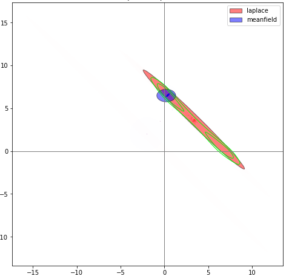

```{r, echo=FALSE, error=FALSE, warning=FALSE, results='asis'}
library(knitr)
library(png)
library(grid)

outputFormat = opts_knit$get("rmarkdown.pandoc.to")
color="red"
if(outputFormat %in% c('latex','beamer')) {
  note = function(x){cat(paste0("\\textcolor{",color,"}{{\\scriptsize ",gsub("[\r\n]", "\\\\\\\\", x),"}}\n\n"))} #2^n backslashes as n->infinity
} else if(outputFormat %in% c('html','ioslides')) {
  note = function(x){cat(paste0("<font color='",color,"',size='small'>",x,"</font>\n\n"))}
} else {
  cat(outputFormat)
  note = function(x){cat(x)}
}
final=F


#note = function(x){cat("")}; final=T #comment out for presenter notes
```

## Big picture overview

$$P(\theta|x)=\frac{P(x|\theta)P(\theta)}{\int_{\theta'\in\Theta} P(x|\theta')P(\theta')d\theta'}$$
If $\Theta$ is high-D, any estimator of the denominator that amounts to numerical integration will fail; variance exponential in dim.

* Chapter 1: online data assimilation on spatiotemporal system
* Chapter 2: new method applicable to latent variable models
* Chapter 3: application of method, extension of existing models


```{r, out.width = "60px", echo=FALSE, results='asis'}
note("You will notice a few changes to what I sent you, particularly in the chapter 3 results; I will point them out as we go along
Talk about Mira
the major motivating ideas (idea of Laplace family, idea of applying VI to EI) come from me
I did all the coding in Pyro
otherwise Mira is equal collaborator and coauthor
we checked that this is allowed")
```

## Collaborator: Mira Bernstein

* On most things, equal collaborator and coauthor
* All the major motivating ideas, and >95% of the coding, is mine
* We checked that this is OK

## Variational Inference

Approximate posterior with a guide distribution $q_{\bm{\phi}}(\bm{\theta})$ and choose $\bm{\phi}$ to mimize KL: 
$$\hat{{\bm{\phi}}}=\mathrm{argmin}_{\bm{\phi}}\left[D_{\mathrm{KL}} \left(\;q_{\bm{\phi}}(\bm{\theta})\;\big|\big|\; p(\bm{\theta}|\bm{x})\;\right)\right].$$
Equivalent to maximizing ELBO:
$$\mathrm{ELBO}({\bm{\phi}}):=E_{q_{\bm{\phi}}}
\left[\mathrm{log} p(\bm{x},\bm{\theta})-\mathrm{log} q_{\bm{\phi}}(\bm{\theta})\right]$$


```{r, out.width = "60px", echo=FALSE, results='asis'}
note("Emphasize conceptual part (minimizing KL-divergence)
Be sure to be clear about difference between model parameters and guide parameters
Talk about why entropy term is important
Mention EUBO")
```


## Pyro

Released in 2017 and still under very active development, pyro is a cutting-edge python package for black-box VI.

* Automatic differentiation via PyTorch ML
* Stochastic optimization
* BBVI seems empirically robust

```{r, out.width = "60px", echo=FALSE, results='asis'}
note("Explain automatic differentiation
All the impressive software engineering I had to do")
```


## Problem with existing (mainstream) VI method

This talk will focus on MVN guide families.

A common assumption is posterior independence of parameters, referred to as "meanfield" guides. Problem:


```{r, fig.align='center', out.width = "150px", echo=FALSE, results='asis'}
note("can’t capture posterior correlations
systematically underestimates posterior marginals")
knitr::include_graphics("meanfield_covar_figure.jpg")
```


## Introduce Laplace family VI (1)

Among MVN guide families:

* Set of all normals, with unrestricted covariance, is too big
* Meanfield subfamily doesn’t actually contain any good approximations
* We want subfamily that contains at least some good approximations without being too big


## Introduce Laplace family VI (2)

Let's guarantee that the family contains the Laplace approximation around any posterior mode.

Define covariance matrix using observed information of posterior; negative of Hessian of unnormalized log-density:

$\mathcal{I}_p\left(\bm{\theta}^*\right)  := -H\left[\log p(\bm{\theta})\right]\bigg\rvert_{\bm{\theta}^*}$


## Boosting

$\mathcal{I}_p$ not guaranteed to be positive definite. So define "boosting" function $f(\mathcal{I}_p)$ s.t.:

* Smooth almost everywhere.
* $f(\mathcal{I}_p)\approx\mathcal{I}_p$ if $\mathcal{I}_p$ already p.d.
A similar problem arises in optimization (quasi-Newton methods); solved via modified Cholesky algorithms (Fang, 2008)

Furthermore, we can parametrize $f$ to create a boosting family $f_{\bm{\psi}}$, for $\psi_i>0$, s.t.:

* Each dimension of $\bm{\psi}$ corresponds to a model parameter
* As $\bm{\psi}\rightarrow\vec{\bm{0}}$ from above, $f(\mathcal{I}_p)\rightarrow\mathcal{I}_p$ if $\mathcal{I}_p$ already p.d.

```{r, out.width = "60px", echo=FALSE, results='asis'}
note("Explain why boosting family is better than just boosting function
Version of thesis sent previously has quasi-boosting which we’re no longer using
Citation for method that we’re actually using")
```


## Formal definition of Laplace family (1)

Let $p(\bm{\theta})$ be a (possibly unnormalized) probability distribution on $\mathbb{R}^d$. Let $\Theta \subseteq \mathbb{R}^d$, $\Psi \subseteq \mathbb{R}^D_+$, and let $f_\Psi$ be a boosting family. 

The Laplace guide family $\mathcal{L}_{\Theta\times\Psi} (p,f_\Psi)$ is the set of $d$-dimesnional normal distributions $\{q_{\bm{\theta}^*,\bm{\psi}}:\bm{\theta}^*\in\Theta,\;\bm{\psi}\in\Psi\}$, where $q_{\bm{\theta}^*,\bm{\psi}}$ has mean $\bm{\theta}^*$ and precision matrix $f_{\bm{\psi}} \left(\mathcal{I}_p(\bm{\theta}^*)\right)$.


## Toy model results

Comparison of Laplace family fit with meanfield fit on simple model with a bimodal posterior:
```{r, fig.align='center', out.width = "150px", echo=FALSE, results='asis'}

note("Simple model with bimodal posterior
Shows several things: Importance of covariance; case where laplace of MAP isn't optimal; case where boosting is necessary, and boosting family is better than boosting function")
```


## Latent variable models (or: why hi-D?)

A latent variable model has 3 core elements:

* Global parameters: $\bm{\gamma}\in\Gamma \cong \mathbb{R}^g$,
* "iid" latent parameter vectors: $\bm{\lambda}_1,\dots,\bm{\lambda}_N\in\Lambda \cong \mathbb{R}^l$
* Observation vectors: $\bm{x}_1,\dots,\bm{x}_N$, also independent conditional on globals and relevant locals. 

In other words, 
$$p\left(\bm{\gamma}, \bm{\lambda}_1,\dots,\bm{\lambda}_N,\bm{x}_1,\dots,\bm{x}_N\right) = p(\bm{\gamma})\prod_{i=1}^N p(\bm{\lambda}_i|\bm{\gamma})\; p(\bm{x}_i|\bm{\lambda}_i,\bm{\gamma})$$


```{r, out.width = "60px", echo=FALSE, results='asis'}
note("This is why we need a high-dimensional solution.")
```


## Block arrowhead matrices

$$\mathcal{I}_p(\bm{\theta}^*) = \left(\begin{array}{ccccc}
    G & C_1 & C_2 & \dots & C_N \\
    C_1^T & U_1 & 0 & \dots & 0 \\
    C_2^T & 0 & U_2 & \dots & 0 \\
    \vdots & 0 & 0 & \ddots & 0 \\
    C_N^T & 0 & 0 & \dots & U_N
    \end{array}\right)$$

Useful fact: if this is viewed as a precision matrix, then the "marginal precision" $([\mathcal{I}_p(\bm{\theta}^*)^{-1}]_{\Gamma,\Gamma})^{-1}=G-\sum_i C_iU_i^{-1}C_i^T$

Call this marginal precision matrix $\mathcal{G}_p(\bm{\theta}^*)$.

```{r, out.width = "60px", echo=FALSE, results='asis'}
note("easy to sample from and easy to boost.")
```


## Additional methods for LV models 1: SVI

```{r, out.width = "60px", echo=FALSE, results='asis'}
note("Two methods that are useful with LV models. Conceptually independent, but go well together. First is:")
```

SVI (Stochastic Variational Inference)

Basic idea: since unnormalized log density is a sum of unit-level terms, use only a randomly-sampled subset of those terms. For a given sampling scheme (possibly weighted), there are obvious estimators for:

* Posterior log density; unbiased
* Hessian thereof. Up to boosting, unbiased for both conditional precision $G$ and marginal precision $\mathcal{G}_p$.
* ELBO and ELBO gradient wrt guide parameters, using the above. Not unbiased, even without boosting; but seem to work well.

```{r, out.width = "60px", echo=FALSE, results='asis'}
note("Mention weights, say we haven’t yet implemented them anywhere
think about exactly what you want to say about its qusi-unbiasedness (have hidden slides with slide with details)")
```


## Additional methods for LV models 2: amortization

An amortized guide family is one that's restricted to a subspace where the latent variables are a function of the globals.

The aim is to find an analytic a priori function that sets the latents to their conditional MAP values, under the assumption that this is the value that will approximately maximize the ELBO given the globals.

If you can get into the right neighborhood, you can take 1 step of Newton's method for free.


```{r, out.width = "60px", echo=FALSE, results='asis'}
note("guide parameters are now just gamma, psi-gamma, psi-lambda
Note that it's MAP not MLE")
```


## Ch 1 Results

\includegraphics[width=3.65in]{ECHSfits.pdf}

```{r, out.width = "60px", echo=FALSE, results='asis'}
note("Changes: df; boosting")
```

## Ch 2: Ecological inference. Relevance: Thornburg v. Gingles

Since the 1986 Supreme Court decision in Thornburg v. Gingles, EI is key to proving the need for redistricting under the Voting Rights Act. Which seems important:

```{r fig.height=5,echo=FALSE}
img <- readPNG("mira's ei slides.png")
 grid.raster(img)
```

## EI: Problem statement (1)

\resizebox{99in}{1.25in}{%
\begin{tikzpicture}[thick,scale=0.9, every node/.style={transform shape},
squared notebook/.pic={\clip[postaction={shade,left color=white}](0,0) rectangle (6.5,4);
\draw[ultra thick](0,0) rectangle (6.5,4);}
]
\foreach \x in {1.25,1,.75,0.5,.25,0}\pic at (\x,\x){squared notebook};
\draw[-latex] (7,0) -- +(1,1) node[below right,midway,rotate=45] {precinct};
\node[rotate=90] (h) at (.5,2) {Race};
\node (w) at (3.99,3.7) {Candidate};


\node (w) at (3.5,2) {$\begin{array}{r|ccc|l}
& X & Y & Z & n_u\\
\hline
White & \red{?} & \red{?} & \red{?} & 400 \\
Black & \red{?} & \red{?} & \red{?} & 200   \\
Hispanic & \red{?} & \red{?} & \red{?} & 100   \\
Other & \red{?} & \red{?} & \red{?} & 100   \\
\hline
v_u & 400 & 200 & 200 & 800\end{array}$};

%\node (w) at (4.5,-1) [text width=8.25cm]{Observed data for one hypothetical precinct};
\end{tikzpicture}}

```{r, out.width = "60px", echo=FALSE, results='asis'}
note("Mainly comes up in voting rights cases, so I’ll talk about it in this setting.
     Z could represent not voting.")
```


## EI: Problem statement (2)

\resizebox{99in}{1.25in}{%
\begin{tikzpicture}[thick,scale=0.9, every node/.style={transform shape},
squared notebook/.pic={\clip[postaction={shade,left color=white}](0,0) rectangle (6.5,4);
\draw[ultra thick](0,0) rectangle (6.5,4);}
]
\foreach \x in {1.25,1,.75,0.5,.25,0}\pic at (\x,\x){squared notebook};
\draw[-latex] (7,0) -- +(1,1) node[below right,midway,rotate=45] {precinct};
\node[rotate=90] (h) at (.5,2) {Race};
\node (w) at (3.99,3.7) {Candidate};


\node (w) at (3.5,2) {$\begin{array}{r|ccc|l}
& X & Y & Z & n_u\\
\hline
White & \red{400} & 0 & 0 & 400 \\
Black & 0 & \red{200} & 0 & 200   \\
Hispanic & 0 & 0 & \red{100} & 100   \\
Other & 0 & 0 & \red{100} & 100   \\
\hline
 v_u & 400 & 200 & 200 & 800\end{array}$};


%\node (w) at (4.5,-1) [text width=8.25cm]{Possible underlying data A: assuming largest groups vote for most-popular candidates};


\foreach \x in {1.25,1,.75,0.5,0.25,0}\pic at (9+\x,\x){squared notebook};
\draw[-latex] (16,0) -- +(1,1) node[below right,midway,rotate=45] {precinct};
\node[rotate=90] (h) at (9.5,2) {Race};
\node (w) at (12.99,3.7) {Candidate};


\node (w) at (12.5,2) {$\begin{array}{r|ccc|l}
& X & Y & Z & n_u\\
\hline
White & \red{200} & \red{100} & \red{100} & 400 \\
Black & \red{100} & \red{50} & \red{50} & 200   \\
Hispanic & \red{50} & \red{25} & \red{25} & 100   \\
Other & \red{50} & \red{25} & \red{25} & 100   \\
\hline
v_u & 400 & 200 & 200 & 800\end{array}$};

%\node (w) at (13,-1) [text width=8.25cm]{Possible underlying data B: assuming candidate's percent support is independent of race};

\end{tikzpicture}}

## History of attempted solutions: ER

{height=2in}

Brexit voting data. (Example by Adam Jacobs.)

## History of attempted solutions: ERrrrr...

{height=2in}

Brexit support: -16% of those with a degree???

<!-- ## King's EI: 2x2 case (1) -->

<!-- Key insight:  -->


<!-- ## King's EI: 2x2 case (2) -->

<!-- ## Rosen, Jiang, King, & Tanner: RxC case (1) -->

<!-- Explain model -->


## Comparison of models

\resizebox{99in}{3in}{%
\begin{tikzpicture}
  % Define nodes
  
  %Row headers
  \node[const]                          (level) {Level};
  \node[const, below=1.2 of level]          (prior) {\red{Prior}};
  \node[const, below=3.2 of level, align=center]          (global) {\orange{Global voting propensities}\\\orange{(for each race)}};
  \node[const, below=5.2 of level, align=center]          (latent) {\green{Precinct-level variation}\\\green{(for each race)}};
  \node[const, below=7.2 of level, align=center]          (unobserved) {\blue{Actual vote totals}\\\blue{(by race \& candidate)}\\\blue{(unobserved)}};
  \node[const, below=9.2 of level, align=center]          (observed) {\purple{Vote totals for each candidate}\\\purple{(observed)}};
  \node[const, below=10.2 of level]          (issues) {Advantages};
  \node[const, below=11.5 of level, align=center]          (issues) {Issues\\ \\ \\ \\};
  
  
  
  %ER
  \node[const, right=2.5 of level]          (ER) {ER};
  \node[const, below=0.1 of ER]          (ERyear) {1953};
  
  \node[latent, below=3 of ER] (ERglobal) {$\orange{\gamma}$};
  \node[obs, below=9 of ER]  (ERx) {$\purple{x}$};
  
  % Connect the nodes
  \edge {ERglobal} {ERx} ;
  
  \node[const, align=center, below=10.2 of ER]      (ERpro) {Simple.};
  \node[const, align=center, below=11.5 of ER]      (ERcon) {Impossible\\estimates.};
  
  
  % King
  \node[const, right=2.5 of ER]           (King) {King};
  \node[const, below=0.1 of King]          (Kingyear) {1997};
  
  \node[const, below=1.2 of King]           (Kingprior) {$\red{\Pi}$};
  \node[latent, below=3 of King] (Kingglobal) {$\orange{\gamma}$};
  \node[latent, below=5 of King] (Kinglatent) {$\green{\lambda}$};
  \node[latent, diamond, below=7 of King] (Kingy) {$\blue{y}$};
  \node[obs, diamond, below=9 of King]  (Kingx) {$\purple{x}$};
  \factor[below=6.25 of King] {Kingdot} {} {} {};
  \node[obs, left=.5 of Kingdot] (Kingn) {$\purple{n_r}$};
  
  
  % Connect the nodes
  \edge {Kingprior} {Kingglobal} ;
  \edge {Kingglobal} {Kinglatent} ;
  \factoredge {Kinglatent,Kingn} {Kingdot} {Kingy} ; 
  \edge {Kingy} {Kingx} ;
  \edge[<->] {Kingy} {Kinglatent} ;
  
  
  \node[const, align=center, below=10.2 of King]      (Kingpro) {Respects constraints.};
  \node[const, align=center, below=11.5 of King]      (Kingcon) {Only $2\times 2$;\\No voter-level\\randomness.};
  
  
  
  
  %RJKT
  \node[const, right=2.5 of King]           (RJKT) {RJKT};
  \node[const, below=0.1 of RJKT]          (RJKTyear) {2001};
  
  \node[const, below=1.2 of RJKT]           (RJKTprior) {$\red{\Pi}$};
  \node[latent, below=3 of RJKT] (RJKTglobal) {$\orange{\gamma}$};
  \node[latent, below=5 of RJKT] (RJKTlatent) {$\green{\beta}$};
  \node[latent, diamond, below=7 of RJKT] (RJKTtheta) {$\green{\theta}$};
  \node[obs, below=9 of RJKT]  (RJKTx) {$\purple{x}$};
  \factor[below=6.25 of RJKT] {RJKTdot} {} {} {};
  \node[obs, left=.5 of RJKTdot] (RJKTn) {$\purple{n_r}$};
  
  % Connect the nodes
  \edge {RJKTprior} {RJKTglobal} ;
  \edge {RJKTglobal} {RJKTlatent} ;
  \factoredge {RJKTlatent,RJKTn} {RJKTdot} {RJKTtheta} ; 
  \edge {RJKTtheta} {RJKTx} ;
  \edge[<->] {RJKTtheta} {RJKTlatent} ;
  
  
  \node[const, align=center, below=10.2 of RJKT]      (RJKTpro) {$R\times C$; includes\\voter multinomial.};
  \node[const, align=center, below=11.5 of RJKT]      (RJKTcon) {Cheats a bit on\\constraints: no $y$.};
  
  
  %Us
  \node[const, right=2.5 of RJKT]           (us) {Us};
  \node[const, below=0.1 of us]          (usyear) {2019};
  
  \node[const, below=1.2 of us]           (usprior) {$\red{\Pi}$};
  \node[latent, below=3 of us] (usglobal) {$\orange{\gamma}$};
  \node[latent, below=5 of us] (uslatent) {$\green{\nu}$};
  \node[latent, below=7 of us] (usy) {$\blue{y}$};
  \node[obs, diamond, below=9 of us]  (usx) {$\purple{x}$};
  \factor[below=6.25 of us] {usdot} {} {} {};
  \node[obs, left=.5 of usdot] (usn) {$\purple{n_r}$};
  
  % Connect the nodes
  \edge {usprior} {usglobal} ;
  \edge {usglobal} {uslatent} ;
  \factoredge {uslatent,usn} {usdot} {usy} ; 
  \edge {usy} {usx} ;
  
  \node[const, align=center, below=10.2 of us]      (uspro) {Respects constraints;\\$R\times C$; "multinomial".\\
  Extensible!};
  %\node[const, align=center, below=11.5 of us]      (uscon) {Few — let me\\describe it first};

  % Plates
  %\plate {U} {(gamma)(y)(multi)(pi)(n)(v)(ubighide)} {$U$} ;
  %\plate {R} {(beta)(gamma)(y)(rbighide)(U.north east)} {$R$} ;
\end{tikzpicture}}


## Our model

\resizebox{99in}{2.5in}{%
\begin{tikzpicture}
  % Define nodes
  \node[latent]           (beta) {$\orange{\bm{\beta}_r}$};
  \node[const, above=0.4 of beta] (rbighide) {};
  \node[const, above=of beta] (sdb) {$\red{\sigma_{\beta}}$};
  \node[latent, left=of beta]  (alpha) {$\orange{\bm{\alpha}}$};
  \node[const, above=of alpha] (sda) {$\red{\sigma_{\alpha}}$};
  \node[latent, right=2 of beta]            (gamma) {$\green{\bm{\nu}_{u,r}}$};
  \node[latent, above=of gamma] (sdg) {$\orange{\sigma_{\nu}}$};
  \node[det, below=.7of gamma]            (pi) {$\green{\bm{\pi}_{u,r}}$};
  \factor[below=.4 of pi] {multi} {right:$\mathrm{Multi}$} {} {};
  \node[obs, left=of multi]            (n) {$n_{u,r}$};
  \node[latent, below=.5 of multi]            (y) {$\blue{\bm{y}_{u,r}}$};
  \node[obs, diamond, below=of y]            (v) {$\purple{\bm{v}_{u}}$};
  \node[const, right=0.6 of y, yshift=-1.6cm] (ubighide) {};
  \node[const, right=1.2 of y] (rbighide) {};

  % Connect the nodes
  \edge {sda} {alpha} ;
  \edge {sdb} {beta} ;
  \edge {sdg} {gamma} ; 
  \edge {alpha,beta,gamma} {pi} ;
  \factoredge {pi,n} {multi} {y} ; 
  \edge {y} {v} ;

  % Plates
  \plate {U} {(gamma)(y)(multi)(pi)(n)(v)(ubighide)} {$U$} ;
  \plate {R} {(beta)(gamma)(y)(rbighide)(U.north east)} {$R$} ;
\end{tikzpicture}}

```{r, out.width = "60px", echo=FALSE, results='asis'}
note("Talk briefly about how you could add other Christmas tree ornaments
Talk about why this is hard to make a guide for")
```


## Modified model

\resizebox{99in}{2.5in}{%
\begin{tikzpicture}
  % Define nodes
  \node[latent]           (beta) {$\orange{\bm{\beta}^-_r}$};
  \node[const, above=0.4 of beta] (rbighide) {};
  \node[const, above=of beta] (sdb) {$\red{\sigma_{\beta}}$};
  \node[latent, left=of beta]  (alpha) {$\orange{\bm{\alpha}^-}$};
  \node[const, above=of alpha] (sda) {$\red{\sigma_{\alpha}}$};
  \node[latent, right=2 of beta]            (gamma) {$\green{\bm{\nu}_{u,r}}$};
  \node[latent, above=of gamma] (sdg) {$\orange{\sigma_{\nu}}$};
  \node[det, below=.7of gamma]            (pi) {$\green{\bm{\pi}_{u,r}}$};
  \factor[below=.4 of pi] {multi} {right:$\mathrm{CMult}$} {} {};
  \node[obs, left=of multi]            (n) {$n_{u,r}$};
  \node[latent, below=.5 of multi]            (y) {$\blue{\bm{y}_{u,r}}$};
  \node[const, right=0.8 of y, yshift=-1.6cm] (ubighide) {};
  \node[const, right=1.4 of y] (rbighide) {};
  \node[det, below=of y]            (W) {$\blue{W_{u}}$};
  \factor[above=.25 of W] {poly} {right:$m$} {} {};
  \node[obs, diamond, left=.66 of W]            (v) {$\purple{\bm{v}_{u}}$};

  % Connect the nodes
  \edge {sda} {alpha} ;
  \edge {sdb} {beta} ;
  \edge {sdg} {gamma}; 
  \edge {alpha,beta,gamma} {pi} ;
  \factoredge {pi,n} {multi} {y} ; 
  \edge[<->] {y} {W} ; 
  \edge[<->] {v} {poly} ; 
  \edge[dashed] {y} {v} ; 

  % Plates
  \plate {U} {(gamma)(y)(multi)(pi)(n)(W)(v)(ubighide)} {$U$} ;
  \plate {R} {(beta)(gamma)(y)(rbighide)(U.north east)} {$R$} ;
\end{tikzpicture}}

```{r, out.width = "60px", echo=FALSE, results='asis'}
note("Cmult; Polytopize: ae smooth bijective map from $R^n$ to polytope
Pseudovoters because of boundary issues that arise from Cmult and polytopize
All of these make the model itself slightly less-realistic, but make VI work.")
```


## Polytopize (1)

\resizebox{4in}{99in}{%
\begin{tikzpicture}[
squared notebook/.pic={\clip[postaction={shade,left color=white}](0,0) rectangle (6.5,4);
\draw[ultra thick](0,0) rectangle (6.5,4);}
]
\foreach \x in {.75,0.5,.25,0}\pic at (\x,\x){squared notebook};
\node[rotate=90] (h) at (.5,2) {Race};
\node (w) at (4,3.5) {Candidate};

%separator
\draw[style=-] (8,0) -- +(0,5) node[below left=.25cm,anchor=base,midway,rotate=-45] {};

\node (w) at (3.5,2) {$\begin{array}{r|lll|l}
& X & Y & Z & \bm{n}_u\\
\hline
\textit{White} & \red{50} & \red{50} & 50 & 150 \\
\textit{Black} & 70 & 70 & 70 & 210   \\
\hline
\bm{v}_u & 120 & 120 & 120 & 360\end{array}$};

\draw[red,fill=red] (11.667,1.667) circle (.5ex);
\node[] at (11.667,1.267)   (c) {$\dot{\bm{Y}}$};

%\tkzDefPoint(7.667,1.667){M}
%\tkzLabelPoint[right,below](M){Independence}

\node[] at (12, -1.1)   (c) {$\mathcal{Y}_u$};

%polytope
\draw[style=-] (11,0) -- +(-1,1) node[below left=.25cm,anchor=base,midway,rotate=-45] {$y_{p11}+y_{p12}>\textcolor{black}{30}$};
\draw[style=-] (11,0) -- +(3,0) node[below=.3cm,anchor=base,midway] {$\textcolor{black}{y_{p12}}>0$};
\draw[style=-] (14,0) -- +(0,1) node[right = .3cm,anchor=base,midway,rotate=90] {$\textcolor{black}{y_{p11}<120}$};
\draw[style=-] (14,1) -- +(-3,3) node[above right=.15cm,anchor=base,midway,rotate=-45] {$y_{p11}+y_{p12}<\textcolor{black}{150}$};
\draw[style=-] (11,4) -- +(-1,0) node[above=.2cm,anchor=base,midway] {$\textcolor{black}{y_{p12}<120}$};
\draw[style=-] (10,1) -- +(0,3) node[left = .2cm,anchor=base,midway,rotate=90] {$\textcolor{black}{y_{p11}}>0$};


\end{tikzpicture}}


## Polytopize (2)

\resizebox{4in}{99in}{%
\begin{tikzpicture}

%axes
\draw[dashed,-latex] (4,2) -- +(.5,0) node[below right,midway,rotate=45] {};
\draw[dashed,-latex] (2,2) -- +(-2.5,0) node[below right,midway,rotate=45] {};
\draw[dashed,-latex] (2,2) -- +(0,2) node[below right,midway,rotate=45] {};
\draw[dashed,-latex] (2,2) -- +(0,-2) node[below right,midway,rotate=45] {};

%vectors in y'
\draw[-latex] (2,2) -- +(.3,.4) node[below right,midway,rotate=45] {};
\draw[-latex] (2.3,2.4) -- +(.3,.4) node[below right,midway,rotate=45] {};
\draw[-latex] (2.6,2.8) -- +(.3,.4) node[below right,midway,rotate=45] {};
\draw[-latex] (2.9,3.2) -- +(.3,.4) node[below right,midway,rotate=45] {};
\draw[fill=black] (3.2, 3.6) circle (.3ex);
\node[above left=0pt of {(3.2, 3.6)}]  {$\bm{w}_1$};


\draw[-latex] (2,2) -- +(-.4,-.3) node[below right,midway,rotate=45] {};
\draw[-latex] (1.6,1.7) -- +(-.4,-.3) node[below right,midway,rotate=45] {};
\draw[-latex] (1.2,1.4) -- +(-.4,-.3) node[below right,midway,rotate=45] {};
\draw[-latex] (0.8,1.1) -- +(-.4,-.3) node[below right,midway,rotate=45] {};
\draw[fill=black] (0.4, 0.8) circle (.3ex);
\node[below right=0pt of {(0.4, 0.8)}]  {$\bm{w}_3$};

\draw[-latex] (2,2) -- +(.5,0) node[below right,midway,rotate=45] {};
\draw[-latex] (2.5,2) -- +(.5,0) node[below right,midway,rotate=45] {};
\draw[-latex] (3,2) -- +(.5,0) node[below right,midway,rotate=45] {};
\draw[-latex] (3.5,2) -- +(.5,0) node[below right,midway,rotate=45] {};
\draw[fill=black] (4, 2) circle (.3ex);
\node[below=0pt of {(4, 2)}]  {$\bm{w}_2$};

%function connector
\node[] at (6, 2)   (a) {$m_u(\bm{w})$};
\node[] at (6, 1.5)   (b) {$\longrightarrow$};

%labels for spaces
\node[] at (2, -1.1)   (c) {};
\node[] at (10, -1.1)   (d) {$\mathcal{Y}_u$};


%polytope
\draw[style=-] (9,0) -- +(-1,1) node[below left=.25cm,anchor=base,midway,rotate=-45] {};
\draw[style=-] (9,0) -- +(3,0) node[below=.3cm,anchor=base,midway] {};
\draw[style=-] (12,0) -- +(0,1) node[right = .3cm,anchor=base,midway,rotate=90] {};
\draw[style=-] (12,1) -- +(-3,3) node[above right=.15cm,anchor=base,midway,rotate=-45] {};
\draw[style=-] (9,4) -- +(-1,0) node[above=.2cm,anchor=base,midway] {};
\draw[style=-] (8,1) -- +(0,3) node[left = .2cm,anchor=base,midway,rotate=90] {};


%vectors in polytope
\draw[-latex] (9.5,1.5) -- +(.3,.4) node[below right,midway,rotate=45] {};
\draw[-latex] (9.8,1.9) -- +(.2,.266) node[below right,midway,rotate=45] {};
\draw[-latex] (10.0,2.166) -- +(.133,.177) node[below right,midway,rotate=45] {};
\draw[-latex] (10.133,2.344) -- +(.0889,.1185) node[below right,midway,rotate=45] {};
\draw[fill=black] (10.222, 2.4625) circle (.3ex);
\node[above left=0pt of {(10.222, 2.4625)}]  {$m_u(\bm{w}_1)$};


\draw[-latex] (9.5,1.5) -- +(-.4,-.3) node[below right,midway,rotate=45] {};
\draw[-latex] (9.1,1.2) -- +(-.2667,-.2) node[below right,midway,rotate=45] {};
\draw[-latex] (8.833,1.0) -- +(-.1778,-.133) node[below right,midway,rotate=45] {};
\draw[-latex] (8.655,.866) -- +(-.1185,-.0889) node[below right,midway,rotate=45] {};
\draw[fill=black] (8.5366, 0.777) circle (.3ex);
\node[below right=0pt of {(8.5366, 0.777)}]  {$m_u(\bm{w}_3)$};

\draw[-latex] (9.5,1.5) -- +(.5,0) node[below right,midway,rotate=45] {};
\draw[-latex] (10,1.5) -- +(.375,0) node[below right,midway,rotate=45] {};
\draw[-latex] (10.375,1.5) -- +(.281,0) node[below right,midway,rotate=45] {};
\draw[-latex] (10.656,1.5) -- +(.211,0) node[below right,midway,rotate=45] {};
\draw[fill=black] (10.8777, 1.5) circle (.3ex);
\node[below=0pt of {(10.8777, 1.5)}]  {$m_u(\bm{w}_2)$};

%dots at 0,0 and independence

\draw[red,fill=red] (9.5,1.5) circle (.3ex);
\node[above left=0pt of {(9.5,1.5)}]  {$\red{m_u(\vec{0})}$};
\node[below=0pt of {(9.5,1.5)}]  {$\red{\dot{\bm{Y}}}$};
\draw[red,fill=red] (2,2) circle (.3ex);
\node[above left=0pt of {(2,2)}]  {$\red{\vec{0}}$};

\end{tikzpicture}}


## Guide, with amortization

too ugly

## Testing our EI on simulated data

Describe how we got the simulated NC data
actual demographics
realistic alpha and beta
we get to experiment sigma_nu


## EI results (1)

Show updated tables from paper


```{r, out.width = "60px", echo=FALSE, results='asis'}
note("Point out that this is different (better!) than what you originally sent, because:
does not underestimate variance (fixed bug)
corrected alphas and betas (so that overall percentages of people of each race voting for each candidate approximate the true 2016 data, as intended)
improved amortization (optimize Y → optimize W)
Conclusion: We are as good as RJKT, but we’re just getting started")
```


## EI results (2)

## Discussion/future work (Ch. 3)

* Including the covariate 
* Multiple elections
* Actual NC data
* Compare hierachical model without EI, Standard RJKT, and our model
* Cross-validation


```{r, out.width = "60px", echo=FALSE, results='asis'}
note("Say that this is the stuff we plan to include in final paper")
```


## Discussion/future work (Ch. 2)

* More on subsampling:

    * general theory of how to assign weights to minimize variance of estimator in subsampling (use Ch 3 as example)
    * maybe some theory to help choose sample size for SVI
* Replace normal with T in guide


```{r, out.width = "60px", echo=FALSE, results='asis'}
note("Say that this will not be in current paper, which is basically done")
```


## Thanks


## Directory of extra slides

## Non-meanfield prior work

Just the list from the paper
Give example of actual theorem you can prove when you have conjugate model structure

## Details on toy model

Just the model

## More on block-arrowhead matrices

Formulas for boosting
Formulas for sampling

(basically just the stuff in the appendix)

## What we expect from subsampling

HARD

## Details of ECHS

The actual model
Result tables

## More details on RJKT

## Possible extensions to our EI model

## Boundary issues with polytope; pseudovoters

HARD

## How our EI amortization works (1)

Which variables are we amortizing: Y, nu, sigma_nu
Steps:
Find approximate mode of p(Y|alpha, beta, nu) constrained to lie on polytope (this is linear algebra plus stirling’s approximation)
One-dimensional Newton’s method to find approximate mode of W. (Not the same thing, because there’s Jacobian, mode of W is further away from boundary)
Find approximate mode of p(nu, sigma_nu| gamma, W) 
Newton’s method (for free!!)

## How our EI amortization works (2)

Details on how we get nu and sigma_nu

## More EI results


## END DEFENSE, START OLD PRESENTATION

## Teaser

```{r fig.width=8, fig.height=5,echo=FALSE}
library(png)
library(grid)
img <- readPNG("mira's ei slides.png")
 grid.raster(img)
```

## Thornburg v Gingles, 1986

A majority-minority district must be created if:

1. A minority group is “sufficiently numerous and compact to form a majority in a single-member district"; and

2. The minority group is \red{\textbf{"politically cohesive"}}; and

3. The "majority \red{\textbf{votes sufficiently as a bloc}} to enable it ... usually to defeat the minority's preferred candidate."

## Ecological data


## Independence?

\begin{tikzpicture}[
squared notebook/.pic={\clip[postaction={shade,left color=white}](0,0) rectangle (6.5,4);
\draw[ultra thick](0,0) rectangle (6.5,4);}
]
\foreach \x in {2,1.75,1.5,1.25,1,.75,0.5,.25,0}\pic at (\x,\x){squared notebook};
\draw[-latex] (7,0) -- +(1.5,1.5) node[below right,midway,rotate=45] {\purple{precinct}};
\node[rotate=90] (h) at (.5,2) {Race};
\node (w) at (3.5,3.5) {\purple{Candidate}};


\node (w) at (3.5,2) {$\begin{array}{l|lll|l}
& R & D & No & \\
\hline
White & \red{200} & \red{100} & \red{100} & 400 \\
Black & \red{100} & \red{50} & \red{50} & 200   \\
Hispanic & \red{50} & \red{25} & \red{25} & 100   \\
Other & \red{50} & \red{25} & \red{25} & 100   \\
\hline
 & 400 & 200 & 200 & 800\end{array}$};

\end{tikzpicture}

## Structure

* Pose the ecological problem (done)
* Quick review of prior approaches
* A basic, extensible model for EI
* Why and how to reparameterize
* Review of variational inference
* Applying variational inference to EI
* Guide (aka variational distribution) based on observed information

## Ecological regression (for $2\times 2$ cases)


```{r fig.height=5,echo=FALSE}
img <- readPNG("brexit_ER.png")
 grid.raster(img)
```

Brexit voting data. (Example from "The Stats Guy" blog by Adam Jacobs.) Valid under certain (strong) assumptions.

## Ecological regression: uh oh


```{r fig.height=5,echo=FALSE}
img <- readPNG("brexit_ER_oops.png")
 grid.raster(img)
```

Brexit supported by 79% of people without a degree... and -16% of those with one??? Ecological fallacy, Simpson's paradox, etc.

## Infer latents, not parameters

Insight from King, Rosen, Tanner 1999: instead of focusing on population parameters, which are not directly constrained by the data, focus on latent parameters, which are.

Refined by Rosen, King, Jiang, Tanner (2001):

* Fully Bayesian model 

* extends to $R\neq 2 \neq C$

* fast, moment-based estimator

* now widely used.

## Issues with RKJT 2001:

The RKJT model can, in principle, be extended to handle additional factors such as:

* inter-row or inter-column correlations
* covariates
* multiple elections
* exit polling data
* etc. 

However: 

* the moment-based estimator breaks down, 
* MCMC on such a high-dimensional latent space can be challenging.

## Flexible model (1)

## Flexible model (3)

{ width=30% } { width=30% }


$$\vec{y}_{p,r}=y_{p,r,c}\Vert_{c=1}^C\sim \operatorname{CMult}\left(n_{p,r},\frac{exp(\alpha_c+\beta_{r,c}\red{+\lambda_{r,c,p}})\Vert_{c=1}^C}{\sum_{c=1}^Cexp(\alpha_c+\beta_{r,c}\red{+\lambda_{r,c,p}})}\right)$$

$$\alpha_c\sim\mathcal{N}(0,\sigma_\alpha)~~~~~~~\sigma_\alpha\sim\operatorname{Expo}(5)$$

$$\beta_{r,c}\sim\mathcal{N}(0,\sigma_\beta)~~~~~~~\sigma_\beta\sim\operatorname{Expo}(5)$$

$$\red{\lambda_{r,c,p}\sim\mathcal{N}(0,\sigma_\beta)}~~~~~~~\sigma_\lambda\sim\operatorname{Expo}(5)$$
$\lambda$ handles overdispersion. Note: Bayesian Occam's Razor.

## Standard Bayesian approach (simplified)

$\begin{array}{cl}
\operatorname{priors}~\pi & \\
\downarrow & \\
\operatorname{parameters}~\theta & \\
\downarrow & \\
\operatorname{latent~variables}~y & \\
\downarrow & \\
\operatorname{data}~z & 
\end{array}$

## Standard Bayesian approach (cont'd)

$\begin{array}{cl}
\operatorname{priors}~\pi & \\
\downarrow & \operatorname{(parameterizes~distribution)}\\
\operatorname{parameters}~\theta & \operatorname{(unobservable~quantities~of~interest;~low-D)}\\
\downarrow & \operatorname{(parameterizes~distribution)}\\
\operatorname{latent~variables}~y & \operatorname{(unobservable~nuisance~parameters;~high-D)}\\
\downarrow & \operatorname{(parameterizes~distribution)}\\
\operatorname{data}~z & 
\end{array}$

## Ecological Inference

$\begin{array}{cl}
\operatorname{priors}~\pi & \\
\downarrow & \operatorname{(parameterizes~distribution)}\\
\operatorname{parameters}~\theta & \operatorname{(unobservable~\red{nuisance~parameters};~low-D\red{?})}\\
\downarrow & \operatorname{(parameterizes~distribution)}\\
\operatorname{latent~variables}~y & \operatorname{(unobserv\red{ed~quantities~of~interest};~high-D)}\\
\downarrow & \operatorname{\red{(deterministic~function)}}\\
\operatorname{data}~z & 
\end{array}$

A likelihood from a deterministic function is an indicator function! 

## Ecological case

Since the likelihood is just an indicator function, the posterior is just the prior, restricted to the set of values where the likelihood is 1 and renormalized. For each precinct, this set turns out to be a polytope $\mathcal{Y}_{z_p}$ in an $(R-1)(C-1)$ dimensional subspace of the full $\mathbb{R}^{RC}$.

\begin{tikzpicture}[
squared notebook/.pic={\clip[postaction={shade,left color=white}](0,0) rectangle (4,4);
\draw[ultra thick](0,0) rectangle (4,4);}
]
\foreach \x in {.75,0.5,.25,0}\pic at (\x,\x){squared notebook};
\node[rotate=90] (h) at (.2,2) {Race};
\node (w) at (2,3.5) {Candidate};


\node (w) at (2.2,2) {$\begin{array}{lll|l}
R & D & No & \\
\hline
\textcolor{red}{y_{p11}} & \textcolor{blue}{y_{p12}} & y_{p13} & \textcolor{olive}{500} \\
y_{p21} & y_{p22} & y_{p23} & \textcolor{purple}{700}   \\
\hline
\textcolor{red}{400} & \textcolor{blue}{400} & 400 & 1200\end{array}$};


\node[] at (8, -1.1)   (c) {$\mathcal{Y}_{z_p}\subset\mathbb{R}^{(R-1)(C-1)}\longleftrightarrow\mathbb{R}^{RC} $};

%polytope
\draw[style=-] (7,0) -- +(-1,1) node[below left=.25cm,anchor=base,midway,rotate=-45] {$y_{p11}+y_{p12}>\textcolor{purple}{100}$};
\draw[style=-] (7,0) -- +(3,0) node[below=.3cm,anchor=base,midway] {$\textcolor{blue}{y_{p12}}>0$};
\draw[style=-] (10,0) -- +(0,1) node[right = .3cm,anchor=base,midway,rotate=90] {$\textcolor{red}{y_{p11}<400}$};
\draw[style=-] (10,1) -- +(-3,3) node[above right=.15cm,anchor=base,midway,rotate=-45] {$y_{p11}+y_{p12}<\textcolor{olive}{500}$};
\draw[style=-] (7,4) -- +(-1,0) node[above=.2cm,anchor=base,midway] {$\textcolor{blue}{y_{p12}<400}$};
\draw[style=-] (6,1) -- +(0,3) node[left = .2cm,anchor=base,midway,rotate=90] {$\textcolor{red}{y_{p11}}>0$};


\end{tikzpicture}

## Independence point

\begin{tikzpicture}[
squared notebook/.pic={\clip[postaction={shade,left color=white}](0,0) rectangle (4,4);
\draw[ultra thick](0,0) rectangle (4,4);}
]
\foreach \x in {.75,0.5,.25,0}\pic at (\x,\x){squared notebook};
\node[rotate=90] (h) at (.2,2) {Race};
\node (w) at (2,3.5) {Candidate};


\node (w) at (2.2,2) {$\begin{array}{lll|l}
R & D & No & \\
\hline
\red{167} & \red{167} & 167 & 500 \\
233 & 233 & 233 & 700   \\
\hline
400 & 400 & 400 & 1200\end{array}$};


\draw[red,fill=red] (7.667,1.667) circle (.5ex);

\node[] at (7.667,1.267)   (c) {Independence};

%\tkzDefPoint(7.667,1.667){M}
%\tkzLabelPoint[right,below](M){Independence}


\node[] at (8, -1.1)   (c) {$\mathcal{Y}_{z_p}\subset\mathbb{R}^{(R-1)(C-1)}\longleftrightarrow\mathbb{R}^{RC}$};

%polytope
\draw[style=-] (7,0) -- +(-1,1) node[below left=.25cm,anchor=base,midway,rotate=-45] {$y_{p11}+y_{p12}>\textcolor{black}{100}$};
\draw[style=-] (7,0) -- +(3,0) node[below=.3cm,anchor=base,midway] {$\textcolor{black}{y_{p12}}>0$};
\draw[style=-] (10,0) -- +(0,1) node[right = .3cm,anchor=base,midway,rotate=90] {$\textcolor{black}{y_{p11}<400}$};
\draw[style=-] (10,1) -- +(-3,3) node[above right=.15cm,anchor=base,midway,rotate=-45] {$y_{p11}+y_{p12}<\textcolor{black}{500}$};
\draw[style=-] (7,4) -- +(-1,0) node[above=.2cm,anchor=base,midway] {$\textcolor{black}{y_{p12}<400}$};
\draw[style=-] (6,1) -- +(0,3) node[left = .2cm,anchor=base,midway,rotate=90] {$\textcolor{black}{y_{p11}}>0$};


\end{tikzpicture}


## Diffeomorphic function $g(y'):\mathbb{R}^{(R-1)(C-1)}\rightarrow\mathcal{Y}_{z_p}$

\begin{tikzpicture}

%axes
\draw[-latex] (2,2) -- +(2,0) node[below right,midway,rotate=45] {};
\draw[-latex] (2,2) -- +(-2,0) node[below right,midway,rotate=45] {};
\draw[-latex] (2,2) -- +(0,2) node[below right,midway,rotate=45] {};
\draw[-latex] (2,2) -- +(0,-2) node[below right,midway,rotate=45] {};

%vectors in y'
\draw[-latex] (2,2) -- +(.3,.4) node[below right,midway,rotate=45] {};
\draw[-latex] (2.3,2.4) -- +(.3,.4) node[below right,midway,rotate=45] {};
\draw[-latex] (2.6,2.8) -- +(.3,.4) node[below right,midway,rotate=45] {};
\draw[-latex] (2.9,3.2) -- +(.3,.4) node[below right,midway,rotate=45] {};


\draw[-latex] (2,2) -- +(-.4,-.3) node[below right,midway,rotate=45] {};
\draw[-latex] (1.6,1.7) -- +(-.4,-.3) node[below right,midway,rotate=45] {};
\draw[-latex] (1.2,1.4) -- +(-.4,-.3) node[below right,midway,rotate=45] {};
\draw[-latex] (0.8,1.1) -- +(-.4,-.3) node[below right,midway,rotate=45] {};

\draw[-latex] (2,2) -- +(.5,0) node[below right,midway,rotate=45] {};
\draw[-latex] (2.5,2) -- +(.5,0) node[below right,midway,rotate=45] {};
\draw[-latex] (3,2) -- +(.5,0) node[below right,midway,rotate=45] {};
\draw[-latex] (3.5,2) -- +(.5,0) node[below right,midway,rotate=45] {};

%function connector
\node[] at (5, -.7)   (a) {$g(y')$};
\node[] at (5, -1.1)   (b) {$\longrightarrow$};

%labels for spaces
\node[] at (2, -1.1)   (c) {$\mathbb{R}^{(R-1)(C-1)}$};
\node[] at (8, -1.1)   (c) {$\mathcal{Y}_{z_p}\subset\mathbb{R}^{(R-1)(C-1)}\longleftrightarrow\mathbb{R}^{RC}$};


%polytope
\draw[style=-] (7,0) -- +(-1,1) node[below left=.25cm,anchor=base,midway,rotate=-45] {$y_{p11}+y_{p12}>100$};
\draw[style=-] (7,0) -- +(3,0) node[below=.3cm,anchor=base,midway] {$y_{p12}>0$};
\draw[style=-] (10,0) -- +(0,1) node[right = .3cm,anchor=base,midway,rotate=90] {$y_{p11}<400$};
\draw[style=-] (10,1) -- +(-3,3) node[above right=.15cm,anchor=base,midway,rotate=-45] {$y_{p11}+y_{p12}<500$};
\draw[style=-] (7,4) -- +(-1,0) node[above=.2cm,anchor=base,midway] {$y_{p12}<400$};
\draw[style=-] (6,1) -- +(0,3) node[left = .2cm,anchor=base,midway,rotate=90] {$y_{p11}>0$};


%vectors in polytope
\draw[-latex] (7.5,1.5) -- +(.3,.4) node[below right,midway,rotate=45] {};
\draw[-latex] (7.8,1.9) -- +(.2,.266) node[below right,midway,rotate=45] {};
\draw[-latex] (8.0,2.166) -- +(.133,.177) node[below right,midway,rotate=45] {};
\draw[-latex] (8.133,2.344) -- +(.0889,.1185) node[below right,midway,rotate=45] {};


\draw[-latex] (7.5,1.5) -- +(-.4,-.3) node[below right,midway,rotate=45] {};
\draw[-latex] (7.1,1.2) -- +(-.2667,-.2) node[below right,midway,rotate=45] {};
\draw[-latex] (6.833,1.0) -- +(-.1778,-.133) node[below right,midway,rotate=45] {};
\draw[-latex] (6.655,.866) -- +(-.1185,-.0889) node[below right,midway,rotate=45] {};

\draw[-latex] (7.5,1.5) -- +(.5,0) node[below right,midway,rotate=45] {};
\draw[-latex] (8,1.5) -- +(.375,0) node[below right,midway,rotate=45] {};
\draw[-latex] (8.375,1.5) -- +(.281,0) node[below right,midway,rotate=45] {};
\draw[-latex] (8.656,1.5) -- +(.211,0) node[below right,midway,rotate=45] {};

%dots at 0,0 and independence

\draw[red,fill=red] (7.5,1.5) circle (.5ex);
\draw[red,fill=red] (2,2) circle (.5ex);

\end{tikzpicture}

$$\frac{d \Vert g(y')-g(0)\Vert }{d\Vert y'\Vert}=y_{p11}y_{p12}(400-y_{p11})(400-y_{p12})(500-y_{p11}-y_{p12})\cdots$$


## Stochastic variational inference (Hoffman et al., 2013)

Goal: approximate \blue{unnormalized} posterior density $p(\theta,y|z)\propto p(z|\theta,y)p_\pi(\theta,y)$ with sampleable parametric distribution $q_\phi(\theta,y)$. (Called a \textbf{guide} in the pyro SVI package for python)

Maximize negative K-L divergence from guide to \blue{normalized} posterior $p(z|\theta,y)p_\pi(\theta,y)/p(z)$:

$$E_{q_\phi}\left(\log\frac{p(z|\purple{\theta},y)p_{\purple{\pi}}(\theta,y)}
{q_\phi(\theta,y)p(z)}\right)<0$$

$$E_{q_\phi}\left(\log[p(z|y)p(\theta,y)]-\log
[q_\phi(\theta,y)]-\purple{\log(p(z))}\right)<0$$

$$E_{q_\phi}\left(\log[p(z|y)p(\theta,y)]-\log
[q_\phi(\theta,y)]\right)<\log(p(z))$$

LHS is the \textbf{ELBO}; goal is to find $\phi$ which maximizes it.

## ELBO terms

$E_{q_\phi}\left(\log[p(z|y)p(\theta,y)]\right)$ is \textbf{energy} term. Maximized if $q$ is a $\delta$ (dirac mass) at MLE for $(\theta,y|z)$. Unboundedly negative if $q$ has probability mass where $p$ doesn't.

$E_{q_\phi}\left(-\log[q_\phi(\theta,y)]\right)$ is \textbf{entropy} term. Maximized by making q diffuse. For example, if $q$ is $\mathcal{N}(\bm{\mu},\Sigma)$, then this is inversely proportional to $\mathrm{det}(\Sigma)$. In principle unboundedly negative, but in practice, it's easier to control than energy term.

Together, they're maximized if $q_\phi$ "imitates" $p$.

```{r fig.width=5, fig.height=2.5,echo=FALSE}
library(ggplot2)
library(data.table)

options(tinytex.verbose = TRUE)

combined = data.table()
varidat = data.table(x=(-300:300)/100)
varidat[,series:="1. Log posterior (unnormalized)"]
varidat[,y:=2-log(1+x^2/5)*3+cos(8*atan(x-1.5))/2/(6*(x-1.5)^2+.8)]

combined = rbind(combined,varidat,fill=T)

varidat[,series:="2. Best Gaussian approximation"]
varidat[,y:=-x^2]
combined = rbind(combined,varidat,fill=T)

varidat[,series:="3. Underdispersed"]
varidat[,y:=log(2)-2*x^2]
combined = rbind(combined,varidat,fill=T)

varidat[,series:="4. Overdispersed"]
varidat[,y:=-log(2)-.5*x^2]
combined = rbind(combined,varidat,fill=T)

varidat[,series:="5. Misplaced (local maximum)"]
varidat[,y:=log(16)-16*(x-1.46)^2]
combined = rbind(combined,varidat,fill=T)

filtered = combined[y> -10, ]

qplot(x,y,color=series,data=filtered) + theme_void()
```

## EI case

Reparameterize with $y=g(y')$, and approximate $p(\theta,g(y'))]$ using $q_{\phi,z}(\theta,y')$. ELBO over $y'$ then becomes:

$$E_{q_{\phi,z}}\left(\log[p(\theta,g(y'))\operatorname{det}(J(g(y')))]-\vphantom{\Big|}\log
[q_{\phi,z}(\theta,y')]\right)$$

A common form of variational inference uses a "mean field" guide which factorizes across all parameters and latents; frequently, one that's Normal in each dimension. This ignores the dependence induced by conditioning on the data; which is particularly strong in the case of EI.

## Laplace family

```{r, out.width = "60px", echo=FALSE, results='asis'}
if(T){}
note("staypuft")
```
*"Choose the form of your posterior"*

Take $q(\theta,y')$ to be a multivariate Normal, and assume that once the ELBO is maximized, its mode $(\hat{\theta},\hat{y})$ coincides with a mode of the posterior. What should its covariance matrix be?

There's an obvious way to approximate a twice-differentiable, unnormalized distribution with a Normal: a Laplace approximation. 

That is, use the observed information matrix:

$$\mathcal{I}(\hat{\bm{y}}',\hat{\theta})=D^2\left(\log[p(\hat{\theta},g(\hat{y}'))\operatorname{det}(J(g(y')))]\right)$$
as the precision matrix of $q$. 

## Graphical posterior


\begin{tikzpicture}

  % Define nodes
  \node[const]           (hats) {$\hat{\bm{\theta}}$};
  \node[const, right=2.5 of hats]            (What) {$\hat{W}_{u}$};
  
  \factor[below=of hats,yshift=-.3cm] {paramdist} {right:$\mathcal{N}$} {} {};
  \node[latent, diamond, aspect=2.5, left=.8 of paramdist]            (Iparams) {$\mathcal{I}^{-1}(\hat{\bm{\theta}})$};
  \node[latent, below=of paramdist]            (params) {$\bm{\theta}$};
  
  
  
  \node[const, below=1.5 of What,xshift=-3cm] (stuff) {};
  
  \factor[below=2.11 of What] {fulldist} {above left:$\mathcal{N}$} {} {};
  \node[latent, diamond, aspect=2.5, right=.8 of fulldist]            (Ifull) {$\mathcal{I}^{-1}(\hat{\bm{\theta}},\hat{W}_{u})$};
  \node[latent, below=of fulldist]            (W) {$W_u$};
  \node[const, right=0.3 of W]            (detour) {};
  \node[det, below=0.6 of W]            (gamma) {$\bm{\gamma}_{u,r}$};
  \node[const, below=0.2 of gamma,xshift=-0.8cm]            (uhide) {};

  % Connect the nodes
  \edge[] {hats} {Iparams} ;
  \edge[-] {hats} {paramdist} ; 
  \edge[-] {Iparams} {paramdist} ; 
  \edge {paramdist} {params} ; 
  \edge {hats,What} {Ifull} ;
  \edge[-] {params} {fulldist}; 
  \edge[-] {Ifull} {fulldist}  ; 
  \edge[-] {What} {fulldist} ; 
  \edge {fulldist} {W} ; 
  \edge[] {W,params} {gamma} ;

  % Plates
  \plate {U} {(gamma)} {$R$} ;
  \plate {U} {(Ifull)(fulldist)(W)(gamma)(uhide)(What)} {$U$} ;
\end{tikzpicture}

## Computability

* Using pyro, a variational inference package for python.
* $\mathcal{I}(\hat{\bm{y}}',\hat{\theta})$ can be calculated using automated differentiation.
* $\mathcal{I}(\hat{\bm{y}}',\hat{\theta})$ is high-dimensional, but due to the structure of the model, sparse (block arrowhead format), so working with it is reasonably efficient. In practice, this means doing sampling "top down" (hyperparameters->parameters->hyperlatents->latents), one precinct at a time at the lower levels.

## Thanks

Thanks to Mira Bernstein, Luke Miratrix, Gary King

## Lower-D posterior (1)

Recall our model:

$\vec{y}_{p,r}=y_{p,r,c}\Vert_{c=1}^C\sim \operatorname{CMult}\left(n_{p,r},\frac{exp(\alpha_c+\beta_{r,c}\red{+\lambda_{r,c,p}})\Vert_{c=1}^C}{\sum_{c=1}^Cexp(\alpha_c+\beta_{r,c}\red{+\lambda_{r,c,p}})}\right)$

$\alpha_c\sim\mathcal{N}(0,\sigma_\alpha)~~~~~~~\sigma_\alpha\sim\operatorname{Expo}(5)$

$\beta_{r,c}\sim\mathcal{N}(0,\sigma_\beta)~~~~~~~\sigma_\beta\sim\operatorname{Expo}(5)$

$\red{\lambda_{r,c,p}\sim\mathcal{N}(0,\sigma_\beta)}~~~~~~~\sigma_\lambda\sim\operatorname{Expo}(5)$

Not only does the dimension of $y$ grow linearly with the number of precincts $P$; because of the latent $\lambda$ parameters, the dimension of $\theta$ does too. This is an issue both in estimating the ELBO and in maximizing it.

## Lower-D posterior (2)

Solution: replace $\lambda_{p,r,c}\Vert_{c=1}^C$ with its MAP value conditional on all the variables connected to it (not conditionally independent): $y_{p,r,c}\Vert_{c=1}^C$, $\alpha_c\Vert_{c=1}^C$, $\beta_{r,c}\Vert_{c=1}^C$, and $\sigma_\lambda$. Because of the form of the model, this is available analytically, and we can trust that the Laplace approximation will still be reasonably good away from the MAP.

This is related to, but somewhat more aggressive than, the idea of "amortized variational inference" developed by Rezende and Mohammed (2015).

